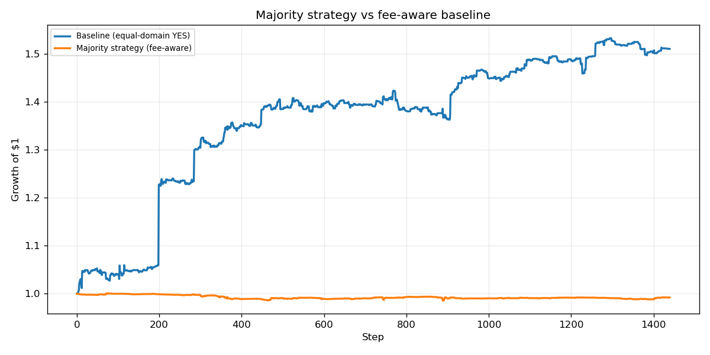
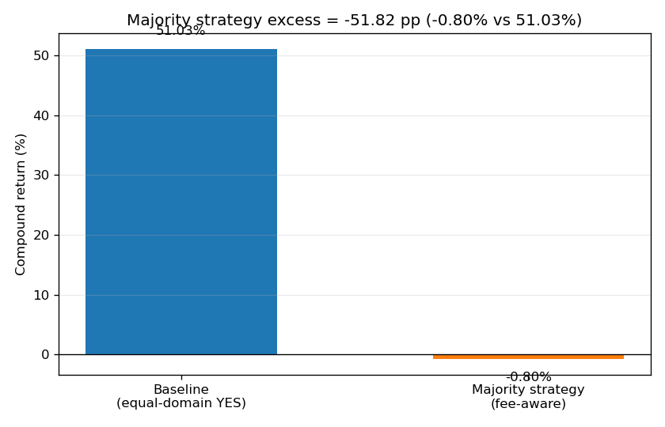
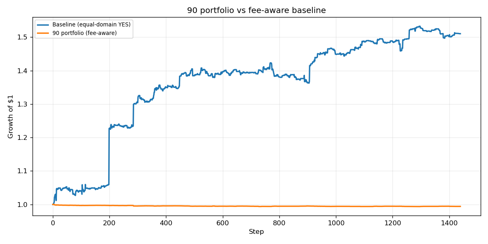
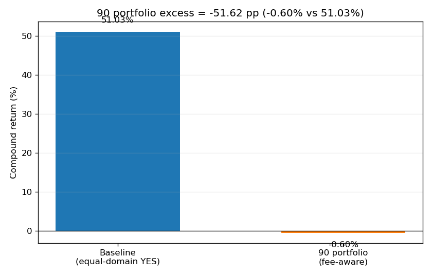
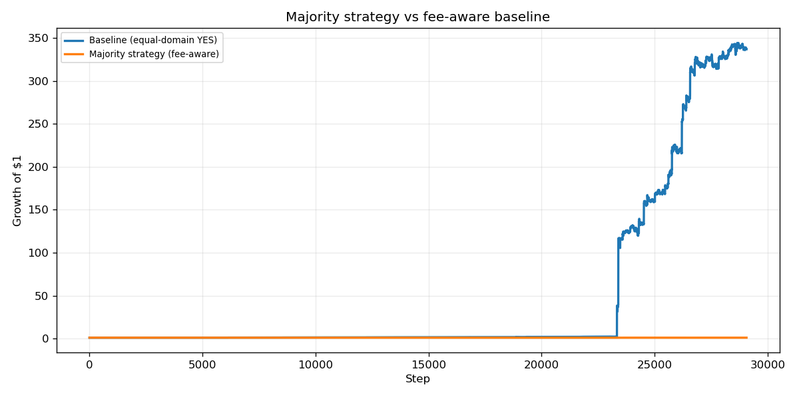
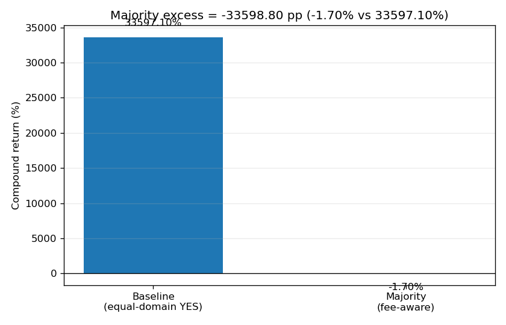

# Appendix: Majority-Side Strategies as Baseline Alternatives

This appendix summarizes the experiments that tested whether a simple "majority side" rule could outperform the fee-aware YES-token baseline. We considered two versions:

- **Majority `>50%` strategy:** for each Polymarket binary market, hold the side with implied probability above `50%`.
- **High-confidence `>90%` strategy:** hold only sides whose implied probability is above `90%`.

Both strategies were evaluated as fee-aware alternatives to the equal-domain YES baseline. Transaction costs were applied as `fee_rate * L1 turnover`, with `fee_rate = 0.001`.

## Strategy Construction

The majority-side strategies use the market YES price as the implied probability:

- If `YES price > threshold`, the strategy holds the YES token.
- If `1 - YES price > threshold`, the strategy holds the synthetic NO side.
- If neither side clears the threshold, the strategy stays in cash for that market and step.

The `>50%` model is almost always invested because one side of a binary market usually has probability above `50%`. The `>90%` model is more selective in theory, but in the final-week run it mostly selected very high-probability NO sides.

The intended intuition was conservative: instead of holding every YES token equally, the model would follow the side that the market considered more likely. If prediction market prices were well calibrated and stable, this should reduce exposure to unlikely YES contracts and produce smoother returns.

## Final-Week `>50%` Majority Strategy

Over the sampled final-week 7-day window, the `>50%` strategy did not beat the baseline:

| Portfolio | Growth of $1 | Gain | Sortino | Max Drawdown |
|---|---:|---:|---:|---:|
| Majority `>50%` strategy | `0.992x` | `-0.80%` | `-0.0121` | `-1.47%` |
| Fee-aware YES baseline | `1.510x` | `+51.03%` | `0.1425` | `-4.25%` |

The majority strategy was almost entirely positioned in synthetic NO exposure:

| Exposure Metric | Value |
|---|---:|
| Average YES weight | `0.96%` |
| Average NO weight | `99.04%` |
| Active step fraction | `100%` |
| Total L1 turnover | `0.10` |
| Total transaction cost | `0.0001` |

The low turnover and low drawdown show that the strategy was stable, but stability was not enough. The equal-weight YES baseline benefited from large upward repricing in a small number of low-priced YES contracts. The majority strategy, by construction, avoided many low-probability YES sides and instead held the "more likely" NO side. That meant it missed the upside events that drove the baseline.

## Final-Week `>90%` High-Confidence Strategy

The stricter `>90%` strategy also failed to outperform:

| Portfolio | Growth of $1 | Gain | Sortino | Max Drawdown |
|---|---:|---:|---:|---:|
| High-confidence `>90%` strategy | `0.994x` | `-0.60%` | `-0.0364` | `-0.64%` |
| Fee-aware YES baseline | `1.510x` | `+51.03%` | `0.1425` | `-4.25%` |

The `>90%` strategy was even more defensive:

| Exposure Metric | Value |
|---|---:|
| Average YES weight | `0.00%` |
| Average NO weight | `100.00%` |
| Active step fraction | `100%` |
| Total L1 turnover | `0.6581` |
| Total transaction cost | `0.0007` |

This result is useful because it shows that confidence filtering alone did not solve the problem. In this dataset, many markets had very low YES prices, so the `>90%` rule effectively became a diversified portfolio of high-probability NO positions. That portfolio avoided volatility, but it also gave up the convex payoff from rare YES repricing jumps.

## Longer-Window `>50%` Majority Result

On the broader final-week processed history, the contrast was even sharper:

| Portfolio | Growth of $1 | Gain | Sortino | Max Drawdown |
|---|---:|---:|---:|---:|
| Majority `>50%` strategy | `0.983x` | `-1.70%` | `-0.0004` | `-10.66%` |
| Fee-aware YES baseline | `336.971x` | `+33,597.10%` | `0.1584` | `-17.43%` |

This extreme baseline result was driven by large YES-token repricing jumps in the underlying Polymarket history. While some of these jumps require caution because sparse quotes and market-selection effects can overstate executable returns, the qualitative conclusion remains the same: the majority-side rule did not capture the upside that made the baseline strong.

## Why the Majority Strategies Did Not Beat the Baseline

The majority strategies failed for four main reasons.

First, they systematically avoided the lottery-like YES exposure that drove baseline returns. The baseline held every YES token, including cheap YES contracts. When a cheap YES token moved from a few tenths of a cent or a few cents toward a materially higher price, the percentage return was very large. The majority rules usually held the opposite NO side in these cases.

Second, "more likely" did not mean "higher expected return." A high-probability NO token may be safer, but its upside is limited. The strategy earned small, stable returns when prices were quiet, but those small returns were overwhelmed by the baseline's occasional YES jumps.

Third, the `>90%` filter became too conservative. It concentrated almost entirely in NO exposure. This reduced drawdown, but it also converted the portfolio into a low-upside defensive strategy rather than a return-seeking strategy.

Fourth, transaction fees were not the main reason for underperformance. Both majority strategies had low turnover and low fee drag. The issue was allocation, not costs: the strategies chose the wrong payoff profile for this particular Polymarket sample.

## Interpretation

The majority-side experiments are valuable as a negative result. They show that simply following the market-implied favorite is not enough to beat an equal-weight YES baseline in this dataset. The baseline performs well because it owns a broad basket of upside convexity: many small YES exposures, any one of which can produce a large jump.

The majority strategies are better interpreted as defensive or calibration-based portfolios. They reduce exposure to low-probability outcomes, but they also remove the exact exposures that generated the baseline's best returns. For future work, a better version would need to combine majority-side information with expected return, liquidity, stale-market filtering, and jump-risk controls rather than relying on implied probability alone.
