# Final Presentation — Slide-by-Slide Guide

Companion to [`docs/final_presentation_technical_primer.md`](final_presentation_technical_primer.md). Read the primer first so the concepts behind each bullet are clear.

**Format:** 10 minutes total, 3 speakers, followed by 2 minutes of Q&A. Each team member answers *"What did you find most useful or surprising about the course material?"* in 30 seconds at the end — budget that separately; it does not count against the 10 min.

**Where the figures live:** `docs/figures/final_presentation/` — generated by the Python build script embedded in §23 of the technical primer. Any figure referenced below as `vX_...png` or `figXX_...png` comes from there.

---

## 1. The narrative (internalize this paragraph)

> We set out to build a portfolio of Polymarket prediction contracts that beats naive equal-weight on risk-adjusted return while capping exposure to any single event domain. On a 40-market, category-balanced universe (11,429 holdout bars at hourly frequency), **no mean-variance / Sortino variant beat the equal-weight baseline** — including pods that integrated macro and listed-equity data: (i) per-step ETF-tracking and explicit macro features (SPY / QQQ / XLE) inside the optimizer (pods B–F, Q, S); (ii) a 5-day momentum pre-screen that reduced the universe to the top-20 moving markets (pods G, H, S1, S4, S5); (iii) an equity risk-regime overlay and a domain→ticker hedge layer on branch `stock-PM-combined-strategy` (Week 16/17) using VIX, XLE, XLV, XLF, QQQ, XLK, WMT, COST, LLY, PG, KO to dynamically tighten/loosen concentration caps and align equity floors to each PM domain; and (iv) learnable market inclusion on branch `learnable-selection` (Pod L) where the universe itself is a differentiable decision variable. The diagnosis was the same across all of them: **the Polymarket universe has effectively one dominant risk factor** (top eigenvalue share 83–86%), so every constrained variant collapsed back toward equal-weight. ETF tracking was *net-negative during US equity hours* (pods C/D), and the Week 17 best trial *turned the equity-signal λ off* (λ = 0). We pivoted to an **expected-log-wealth (Kelly) objective with a dynamic Gaussian copula** whose correlation matrix is emitted every step by a small MLP over macro features, trained jointly with portfolio weights by Adam-OGD on the projected simplex. The resulting policy, **K10C**, beats baseline by **+0.46 total log-wealth (+58 pp CAGR)** gross-of-fees — but three honesty post-hocs show the edge is **barely statistically significant (z = +1.91)**, **destroyed by 10 bps of fees** (break-even 3.76 bps), and **over-levered** (Sortino argmax at α ≈ 0.60). Two targeted fixes closed most of the gap: **K10D** adds an L1 turnover penalty inside the loss (cuts turnover ~5×, keeps +0.27 log-wealth), and **Pod M-seed7** combines Kelly with the 5-day momentum pre-filter — the one cross-term no prior pod ran (+0.027 Sortino Δ, +0.22 log-wealth, 75.8% bootstrap-positive). Both are directionally correct; neither is decisive at single-seed. Conclusion: the Kelly+copula direction is promising, but a deployable edge needs fee-awareness at train time, multi-seed confirmation, and richer features than hourly macro returns.

---

## 2. Headline numbers to know cold

| Strategy | Log-wealth | Δ vs baseline | CAGR | Max DD | Sortino | Avg daily turnover |
|---|---:|---:|---:|---:|---:|---:|
| Equal-weight baseline | +0.408 | — | +36.7% | −4.5% | +0.053 | 0 |
| MVO + macro/ETF (pod F, joint) | — | Sortino Δ **−0.020** | — | −7.9% | +0.072 | — |
| MVO + momentum top-20/5d (pod S1, seed 1) | — | Sortino Δ **+0.015** | — | −21.5% | +0.076 | — |
| MVO + learnable inclusion (Pod L, 40 mkts) | — | Sortino Δ **−0.017** (CI [−0.069, +0.023]) | — | −9.9% | +0.022 | — |
| **K10C** (Kelly + dynamic copula) | **+0.868** | **+0.460** | **+94.5%** | **−11.7%** | +0.058 | 0.107 |
| K10D (K10C + L1 turnover penalty) | +0.678 | +0.270 | +68.1% | −10.8% | — | **0.020** |
| Pod M-seed7 (Kelly × momentum top-20/5d) | — | Sortino Δ **+0.027**, log-w Δ +0.22 | — | −27.1% | +0.064 | 0.011 |

> **Week 17 stock-PM combined strategy** tested separately — directionally underperformed baseline; best Optuna trial set `equity_signal_lambda = 0`. Not a headline number in this deck; mentioned on Slide 5.
>
> **Option A 3-seed novel combo** (momentum × baseline-shrinkage × macro=both) on `direction-B`: Δ Sortino = **−0.0169 ± 0.0003** across seeds {7, 42, 123} — 0/3 positive. Proves that our negative results replicate tightly.

**Bootstrap CI (K10A/B/C, 1000 circular-block replicates):**

| Strategy | Gross Δ | 95% CI | Pr(Δ > 0) | z |
|---|---:|---|---:|---:|
| K10A | +0.18 | [−0.24, +0.52] | 0.68 | +0.88 |
| K10B | +0.23 | [−0.15, +0.59] | 0.71 | +1.12 |
| K10C | **+0.46** | **[+0.005, +0.973]** | **0.975** | **+1.91** |

**Fee break-even:** K10A = 5.60 bps, K10B = **10.93 bps**, K10C = **3.76 bps**. At 10 bps, K10C Δ flips to **−0.76**.

**α-blend on K10C:** Sortino argmax at **α ≈ 0.60**. At α = 0.5, log-wealth keeps 75% of the Kelly edge but MaxDD shrinks from −11.7% → −7.6%.

---

## 3. Speaker plan

- **Speaker 1** — Problem, data, baseline, MVO method, MVO result → Slides 1–4 (~2:30)
- **Speaker 2** — Everything we tried to beat it (macro / ETF / stock-PM / momentum / learnable universe), diagnosis, pivot to Kelly, K10C headline → Slides 5–8 (~3:30)
- **Speaker 3** — Three honesty post-hocs + closing fixes (K10D, Pod M-seed7) + next steps → Slides 9–11 (~3:00)
- **All three** — 30-second "most useful / surprising course material" each. Budget this *after* the 10 min, not within it.

Total spoken content: ~9:00. Target to finish at 9:30–9:50 with buffer for transitions.

---

## Slide 1 — Title (5 sec, Speaker 1)

- Title: **Cross-Domain Portfolio Optimization on Polymarket**
- Three team-member names, course + date
- Hook one-liner: *"Can differentiable domain caps beat equal-weight on a prediction-market portfolio?"*
- **Optional visual:** Polymarket contract sampler screenshot (V10) or an app icon in the corner.

---

## Slide 2 — Why this problem (35 sec, Speaker 1)

- Prediction markets are real-money, real-time probability bets.
- 40 "different" binary contracts may share one macro driver (an election, a rate decision) — hidden event-clustering risk.
- **Takeaway:** naive equal-weight diversifies **count**, not **risk**. Can a constrained optimizer cap **domain** exposure and beat it?

**Figure:** `v9_event_clustering.png` — bipartite schematic with 4 latent drivers on the left and 40 contracts on the right, dotted many-to-one lines. One-line caption: *"N = 40 contracts, ~ 4 effective factors — count diversification ≠ risk diversification."*

**Speaker note:** audience is not Polymarket-native. Take 5 seconds to point at one latent driver and say *"Election day. Every election market moves together when the exit polls drop."*

---

## Slide 3 — Data pipeline (35 sec, Speaker 1)

**Figure:** inline mermaid block, no external PNG needed.

```mermaid
flowchart LR
    gamma["gamma-api.polymarket.com<br/>60 events"]
    flatten["flatten to Yes/No<br/>binary markets"]
    tag["tag to domain<br/>via _derive_category_from_tags"]
    filter["drop admin/rewards<br/>liquidity + history gates"]
    select["_select_balanced_market_rows<br/>round-robin fill<br/>40 markets"]
    clob["CLOB hourly price history<br/>57,141 bars"]
    split["walk-forward + 20% holdout<br/>11,429 holdout bars"]
    cache["cached week8_*.csv"]

    gamma --> flatten --> tag --> filter --> select --> clob --> split --> cache
```



**Key numbers on slide:** 40 markets · 40 domains · 57,141 bars · 80/20 walk-forward / holdout split.

**Speaker note:** this is the audience's only chance to see the data flow. Don't rush. Point at each box once.

---

## Slide 4 — Baseline, MVO objective, training loop (55 sec, Speaker 1)

Two columns of content; tight slide.

**Left — the baseline and the objective.**

The baseline is equal-weight $w_i = 1/N$, every bar. Zero hyperparameters. The null hypothesis.

**Objective we minimize** (MVO with mean–downside surrogate):

$$
\mathcal L(w) = -\,\mathbb{E}[R] + \alpha_v\text{Var}(R) + \beta_d\,\mathbb{E}[\max(-R, 0)^2] + \lambda_\Sigma\, w^\top\Sigma w + \lambda_d\sum_d \max(0,S_d(w)-L_d)^2 + \lambda_c\sum_i\max(0,w_i-w_{\max})^2 - \lambda_e\,H(w)
$$

on the simplex $\Delta^{N-1}$, with a uniform-mix floor $\tilde w = (1-\alpha)w + \alpha u$.

**Parameterization:** **projected simplex** (not softmax) — Adam step, then $O(N\log N)$ sort-based Euclidean projection. This matters on Slide 6 because it means weights can reach exactly zero.

**Right — the training loop.**

- **Online Gradient Descent (OGD)**, not offline SGD. At each holdout bar $t$: 3 Adam steps on a rolling window $[t-W, t)$ → project → realize $r_t$ → advance. State persists across all 11,429 bars.
- **Hyperparameters tuned by Optuna's QMCSampler (scrambled Sobol) + MedianPruner** — we migrated from TPE/Bayesian on Apr 16 because 14 conditional dimensions × 100 trials is below Bayesian's viability threshold.

**Figure:** `v1_ogd_ribbon.png` — OGD timeline across 3 bars with state-persists dotted line, plus the rejected offline-SGD block with a red X.

**Speaker note for Q&A readiness:** Adam is itself an OGD algorithm (Kingma & Ba 2014 Theorem 4.1). We are not stacking OGD on top of SGD — we are running Adam *as* the per-step update rule in an online rolling loop, with the Kelly pipeline additionally resampling MC noise inside each inner step.

---

## Slide 5 — Things we tried to break the baseline (75 sec, Speaker 2)

The single most important slide for showing technical breadth. Five tiles, each with one-line rationale and one-line result.

**Figure:** `v6_things_we_tried_scorecard.png` — 5-tile scorecard with mini risk-return scatters. Each tile shows that category's pods on (Δ MaxDD, Δ Sortino); the grey band is the ±0.036 seed-noise floor.

**Tile A — ETF tracking + macro features (pods B / C / D / F / Q / S).**
Added a tracking loss toward SPY / QQQ / XLE mix and explicit macro returns as features (`macro_integration ∈ {rescale, explicit, both, joint}`). Sortino Δ range: **−0.06 to −0.02**. Most interesting side-finding: **ETF tracking was net-negative in aggregate but positive during US equity hours** (pod C: Δ_open = +0.055, Δ_closed = −0.089, and closed bars outnumber open 5.7 : 1).

**Tile B — Momentum pre-screening (pods G / H / S1 / S4).**
`--momentum-screening --momentum-top-n 20 --momentum-lookback-days 5`. Universe shrinks to 20 markets with largest |5-day return|. Sortino Δ range: **+0.008 to +0.016** (S1 seed 1 = +0.015). Positive but inside the noise band.

**Tile C — Kelly + dynamic copula (K10A/B/C/D).**
Full architecture on Slide 7. The only tile that exits the noise band. Foreshadowing.

**Tile D — Stock-PM combined strategy (`origin/stock-PM-combined-strategy`, Week 16/17).**
Two listed-equity layers: (1) a risk-regime z-score from SPY / VIX / XLE / XLV / XLF / QQQ / XLK + defensives (WMT / COST / LLY / PG / KO) that dynamically reshapes `max_domain_exposure` and concentration λ (risk-on → loose; risk-off → tight); (2) a domain→ticker map (XLF→finance, IBIT→crypto, XLK→science, SPY default) provides a positive-part floor and an optional λ-scaled equity-signal term. Best Optuna trial set `equity_signal_lambda = 0` — **the optimizer itself decided the topic→ticker reward channel wasn't worth using**.

**Tile E — Learnable market inclusion (Pod L, `origin/learnable-selection`).**
A meta-optimization: the universe itself becomes a differentiable decision variable. Per-market inclusion gates $\sigma(g_i) \in (0, 1)$ replace the binary `available_mask`; commitment penalty drives $\sum_i \sigma(g_i) \to k_\text{target} = 15$; gates trained jointly with weights. Result: Sortino Δ **−0.017** (CI [−0.069, +0.023]); hand-picked top-20 momentum (Pod G) beat it with +0.034. **Added flexibility overfits.**

**Closing line to land the slide:** *"Five distinct levers to inject outside information or learn the universe — none broke equal-weight at statistical significance."*

---

## Slide 6 — Diagnosis: single-factor dominance (35 sec, Speaker 2)

**Figure:** `fig02_pca_eigenvalue_stacked.png` — horizontal stacked bar showing top-5 PCA eigenvalue shares per MVO pod; top-1 is 83–86% across pods B, C, F.

Optional supplement: `v5_domain_stackplot.png` — area-stacked domain exposures showing MVO and baseline are visually indistinguishable.

**Key line (strengthened by the projected-simplex parameterization from slide 4):**
*"Our optimizer was **free to concentrate** — projected simplex can reach corners. It chose not to. With ~1 effective risk factor, equal-weight already exploits the only bet."*

**One-line takeaway:** *"This is a structural property of the universe, not a tuning issue."*

Reference: [`docs/week9_cross_pod_synthesis.md`](week9_cross_pod_synthesis.md) §4.2.

---

## Slide 7 — Pivot to Kelly + dynamic copula (65 sec, Speaker 2)

**Figure:** `v2_kelly_architecture.png` — full forward + backward block diagram with the four non-convex blocks highlighted in pink.

If space permits, `v4_static_correlation.png` as a smaller inset — the *"here's the static Σ that the dynamic copula replaces with a macro-conditioned R_t"* visual.

**Three bullets the audience must hear:**

1. **Kelly / log-wealth is the right objective** for a multiplicative, binary-payoff setting (not Sortino). It optimizes geometric growth; MVO optimizes an arithmetic-variance proxy that can be catastrophically wrong when returns are large or non-Gaussian.
2. **Macro data re-enters here — but differently.** Not as a tracking target (which failed on Slide 5), not as a loss-additive term (which Week 17 set to zero), but as the **conditioning signal for the risk model**. The MLP reads SPY / QQQ / BTC returns and emits a correlation matrix $R_t$ every step.
3. **Joint Adam-OGD over $(w, \theta)$ on the same projected simplex used in MVO**, plus straight-through Bernoulli estimator for the binary payoff. The objective is *severely non-convex* because of the MLP × Φ × PD-shrinkage × threshold stack.

Reference: [`docs/week10_kelly_academic_summary.md`](week10_kelly_academic_summary.md).

**Speaker note on the clean handoff to Slide 8:** *"Same projection geometry we used in MVO. Same Adam-OGD outer loop. Only the objective and the θ-block change."*

---

## Slide 8 — K10C headline result (40 sec, Speaker 2)

**Figure:** `fig03_k10c_cumulative_log_wealth.png` — cumulative log-wealth vs baseline on 11,429 holdout bars with Δ annotated at the right edge.

Optional supplement: `v3_weight_heatmap_4panel.png` — 4-panel weight heatmap showing baseline ≈ uniform, MVO ≈ uniform, K10C actively reallocating, Pod M-seed7 sparse. If time is tight, save this for Slide 11 or appendix.

**Callouts on slide:** **+0.46 log-wealth** · **+58 pp CAGR** · **Max DD −11.7% vs −4.5%**.

**One-line hook to Slide 9:** *"This looks great. Three tests say be careful."*

---

## Slide 9 — The honesty slide: three post-hocs (90 sec, Speaker 3)

This is the largest slide in the deck. Don't skip it — it is the strongest clarity-and-honesty signal to the grader.

Three-panel layout:

**Panel A — Bootstrap CI.** Figure: `fig04_bootstrap_ci_histogram.png`. Histogram of 1000 circular-block (block = 24) log-wealth Δ replicates; vertical lines at 95% CI [+0.005, +0.973]; z = +1.91 annotated.
*Caption:* "Marginal statistical significance. Pr(Δ > 0) = 0.975."

**Panel B — Net-of-fees ladder.** Figure: `fig05_net_of_fees_ladder.png`. Grouped bar at fee ∈ {0, 10, 50, 200} bps for K10A / K10B / K10C.
*Caption:* "Break-even fee 3.76 bps — unrealistic on Polymarket."

**Panel C — α-blend frontier.** Figure: `fig06_alpha_blend_with_dd.png`. Sortino curve with MaxDD overlay across α ∈ [0, 1]; Sortino argmax marked at α ≈ 0.6.
*Caption:* "K10C is over-levered; fractional Kelly α ≈ 0.6 maximizes risk-adjusted return."

**Optional fourth panel:** `v7_underwater_drawdown.png` — baseline / K10C / K10D underwater curves. Slot in if time allows; otherwise keep it for appendix.

**One spoken line to land the slide:** *"Gross edge is real but marginal, destroyed by fees, and over-levered on risk-adjusted terms — three problems, three fixes."*

---

## Slide 10 — Two fixes that closed the gap (55 sec, Speaker 3)

**Figure:** `fig07_k10d_podm_grouped_bar.png` — three-subplot grouped bar across {K10C, K10D, Pod M-seed7} showing total log-wealth, avg daily turnover L1, and |Max drawdown|.

Optional supplement: `v8_turnover_histogram.png` — K10C vs K10D turnover distributions, K10C has a fat right tail, K10D is tight near zero.

**Bullet narrative:**

- **K10D (`origin/cloud-runs-K10D`)** — adds an L1 turnover term $+ \lambda_\text{turn} \|w_t - w_{t-1}\|_1$ to the loss → turnover drops from 0.107 → **0.020** (~5×), log-wealth Δ still **+0.27**, MaxDD −10.8%. Directional fix for the fee-fragility problem.
- **Pod M-seed7 (`origin/cloud-runs-M-seed7`)** — Kelly + dynamic copula run on the 20-market **momentum top-k/5d pre-filtered universe** — the cross-term no prior pod had run. This is the direct combination of Kelly machinery from the K10 series with the momentum screen from pods G and S1. Result: Sortino Δ **+0.027**, log-wealth Δ **+0.22**, Pr(Δ > 0) = **0.758** bootstrap.

Reference: [`docs/option_B_results.md`](option_B_results.md) on `origin/cloud-runs-M-seed7`.

**Honest caveat:** neither fix is decisive at single-seed. Both are single-pod single-seed results; multi-seed confirmation is future work.

---

## Slide 11 — Honest takeaway + what we'd do next (40 sec, Speaker 3)

**Figure:** `v13_next_steps_map.png` (stretch) — 2D schematic mapping every pod into the (features, universe) plane with the "next-steps region" highlighted. If the slide is too busy, drop the figure and use a text-only three-bullet list.

**Three bullets, in order:**

1. **MVO never beat equal-weight** — not with ETF tracking, not with explicit macro features, not with per-domain equity floors, not with a VIX-driven risk-regime overlay, not with learnable market inclusion. **Single-factor dominance** is a property of this universe.
2. **Kelly + dynamic copula has a real gross edge** (z ≈ 1.9), precisely because it uses macro data as a *risk-model input* instead of a *tracking target*. But without fee-awareness at train time and multi-seed CIs, we cannot claim a deployable strategy.
3. **Directionally-correct fixes exist** — the turnover penalty in K10D for fee-fragility, momentum × Kelly in Pod M-seed7 for risk-adjusted lift. **Next:** fee-aware Kelly (train with $\lambda_\text{fee}$ > 0), multi-seed replication, expand universe beyond 40 markets to break the single-factor regime, and replace hourly macro returns with event- / resolution-proximity features.

**End on:** *"We didn't ship a winner. We shipped a clean, falsifiable map of where winning lives."*

---

## Slide 12 — Closing (no slide, ~3 sec handoff)

- *"Questions?"*
- Then each speaker takes **30 seconds** to answer: *"What did you find most useful or surprising about the course material?"*

**Talking-point seeds** (pick your own honestly — do not script these exactly):

- *The gap between walk-forward CV Sortino and holdout Sortino.* We routinely saw 3–5× overfit between tuning score and realized holdout. Selection bias made concrete.
- *Circular-block bootstrap CIs on autocorrelated time series.* One of the rare course tools that paid off immediately; a standard bootstrap would have given us false-confidence CIs.
- *How severely non-convex the joint $(w, \theta)$ landscape becomes once a learned correlation matrix enters the loss.* The four-pillar non-convexity argument (MLP × Φ × PD-shrinkage × straight-through Bernoulli) is not academic theater — it genuinely produces many local optima we had to tolerate.
- *Kelly ≠ Sortino at binary payoffs.* The right **objective** matters more than the right **optimizer**. We changed objectives (not optimizers) and finally beat baseline.
- *Why quasi-random beats Bayesian optimization at 100 trials over 14 conditional dims.* TPE/GP need thousands of trials to pay back their surrogate overhead; Sobol just covers the cube.
- *OGD vs offline SGD.* The production deployment loop = the training loop. Train-once-deploy-forever would have broken within weeks of expiring-contract regime shift.

---

## Appendix A — MVO disambiguation (backup slide)

**MVO** = Mean–Variance Optimization (Markowitz 1952). Classical closed-form: $\max_w \ w^\top\bar r - \lambda\, w^\top\Sigma w$ on the simplex.

Our MVO is not pure Markowitz. Reward is a **mean–downside surrogate** $\mathbb{E}[R] - \alpha_v\text{Var}(R) - \beta_d\,\mathbb{E}[\max(-R, 0)^2]$. Risk is $\lambda_\Sigma w^\top\Sigma w$. Plus domain, concentration, entropy penalties, and a uniform-mix floor.

Still MVO in spirit: reward linear in $w$, risk quadratic in $w$, feasible set is the simplex. Convex in $w$ for fixed hyperparameters. Contrast with Kelly (§12 of primer) which is information-theoretic / growth-optimal, not mean–risk.

---

## Appendix B — How the 40 markets are chosen

Function: `_select_balanced_market_rows` in [`src/polymarket_data.py`](../src/polymarket_data.py) lines 223–274. Pipeline entry: [`script/polymarket_week8_pipeline.py`](../script/polymarket_week8_pipeline.py) line 944 `max_markets=40`.

Nine-step recipe (§4 of primer). Breadth-biased + liquidity-gated + history-clean + round-robin filled.

Representative domains in our Week 9/11 builds: databricks, economic-policy, anthropic, awards, california-midterm, bundesliga, 2025-predictions, claude-5, gemini-3, champions-league, colombia-election, big-tech, france, formula1, colorado-midterm, epstein, best-of-2025, bitcoin, ethereum.

---

## Appendix C — Softmax vs projected simplex

Both MVO and Kelly pipelines ran on **projected simplex** — confirmed in every pod's `*_best_metrics.json` on branches `cloud-runs-B`, `cloud-runs-F2`, `cloud-runs-G2`, `cloud-runs-I4`, `cloud-runs-Q5`, `cloud-runs-S1`, `cloud-runs-K10C`. The dataclass default is `"softmax"` but [`script/polymarket_week8_pipeline.py`](../script/polymarket_week8_pipeline.py) line 990 overrides:

```python
weight_parameterization="projected_simplex",
```

**Why this matters MVO-specifically:** projected simplex allows weights to reach exactly zero. The optimizer *could* have concentrated — it chose not to. This strengthens the "single-factor dominance is structural" argument. Under softmax, someone could argue the parameterization was biasing toward the interior; under projected simplex that excuse is unavailable.

---

## Appendix D — "Constrained" vs "baseline" terminology

- **Constrained** — whatever our optimizer produced (MVO, Kelly, stock-PM, Pod L, Pod M). All optimizer variants.
- **Baseline** / **equal-weight** — $w_i = 1/N$ for every available market, recomputed every bar. Zero-turnover. No learning.
- All Δ metrics in the deck are **(constrained − baseline)** on the same 11,429-bar holdout.

---

## Appendix E — Hyperparameter tuning: Sobol quasi-random, not Bayesian

- **What we use:** `optuna.samplers.QMCSampler(qmc_type="sobol", scramble=True, seed=cfg.seed)` + `MedianPruner` — [`src/constrained_optimizer.py`](../src/constrained_optimizer.py) line 1906; [`src/kelly_copula_optimizer.py`](../src/kelly_copula_optimizer.py) line 948.
- **What we migrated from:** TPE/Bayesian. Commit `54d6754` on Apr 16, 2026 replaced `TPESampler` with `QMCSampler`. Commit message: *"changing to quasi-random optimization instead of bayesian optimization"*.
- **Five reasons** (full detail in §11 of primer):
  1. High-dim conditional space — conditional HPs break surrogate assumptions.
  2. Cheap trial budget (100 trials × 14 dims) is below Bayesian's viability.
  3. Embarrassingly parallel — Sobol emits deterministic trial specs; `optuna_n_jobs > 1` speedup; Bayesian is sequential by construction.
  4. Non-smooth, noisy walk-forward objective — surrogate would fit noise.
  5. Seed-reproducibility via `scramble=True` — required for multi-seed pods.

---

## Appendix F — Pod L learnable market inclusion

- Per-market inclusion gates $\sigma(g_i) \in (0, 1)$ replace the binary `available_mask`.
- Commitment penalty drives $\sum_i \sigma(g_i) \to k_\text{target} = 15$.
- New hyperparameters: `target_k`, `commitment_penalty_lambda`, `inclusion_entropy_lambda`, `inclusion_learning_rate`.
- Result: Sortino Δ **−0.0172**; 95% CI [−0.069, +0.023]; 23% seeds positive; max domain exposure 0.0514 (≈2× uniform).
- Best hyperparams: `learning_rate=0.015`, `rolling_window=96`, `domain_limit=0.101`, `max_weight=0.054`, `concentration_penalty_lambda=43.0`, `covariance_penalty_lambda=9.54`, `uniform_mix=0.011`.
- Interpretation: added flexibility without a strong prior overfits on a noisy walk-forward signal. Hand-picked momentum screen (Pod G, +0.034) generalizes better.

Reference: [`docs/direction_A_results.md`](direction_A_results.md) on branch `origin/learnable-selection`.

---

## Appendix G — Online Gradient Descent (OGD)

**What OGD is** (Zinkevich 2003): at each time $t$, decide $w_t$, observe $\ell_t(w_t)$, then update $w_{t+1} = \Pi_\Delta(w_t - \eta_t\nabla\ell_t(w_t))$. Performance guarantee: **regret** = $\sum_t \ell_t(w_t) - \min_w \sum_t \ell_t(w)$ is $O(G\sqrt{T})$ for convex $\ell_t$ on a bounded convex set.

**What we actually run:**

- Outer online loop: [`src/constrained_optimizer.py`](../src/constrained_optimizer.py) line 447 (`for t in range(rolling_window, ...)`); one iteration = one holdout bar.
- `steps_per_window` (3–5) Adam updates per bar: [`src/constrained_optimizer.py`](../src/constrained_optimizer.py) line 504.
- Projection after each step: `_project_to_simplex` line 304; `_project_parameter_vector_inplace` line 346.
- Kelly adds inner MC-SGD: [`src/kelly_copula_optimizer.py`](../src/kelly_copula_optimizer.py) line 577 comment *"Resample epsilon every inner step (true SGD on the MC estimator)"*.
- State persists across all 11,429 holdout bars — no re-init.

**Why OGD, not offline SGD:**

1. **Non-stationarity.** Polymarket contracts *expire*; return distribution is different month to month. IID-sampling assumption is violated.
2. **Autocorrelation / dynamic cross-market correlation.** Shuffled minibatches destroy the structure we need.
3. **Deployment semantics.** Production receives a new bar and must decide; our OGD loop *is* the production loop.
4. **Regret is the right metric for Kelly/MVO** — we care about cumulative realized wealth, not IID test loss.
5. **Warm-started θ tracks regime shifts.** Offline SGD would lock in whatever macro regime dominated training.
6. **Adam handles the L1 turnover kink** via per-coordinate moments; vanilla SGD would need a proximal step.

**"Went away from SGD" disambiguation:** we did **not** stop using stochastic gradients. We replaced the offline IID-batch protocol (shuffle → minibatch → epoch) with the online rolling-window protocol that matches how prediction markets produce data. The estimator inside each step is still stochastic (MC in Kelly).

**Deck one-liner:** *"We update after every bar on a rolling window — that's OGD. Offline SGD would have forced a train-once-deploy-forever loop that Polymarket's expiring-contract dynamics would make obsolete within weeks."*

---

## Appendix H — Where is our "true" probability? (Kelly deep dive for Q&A)

**Anticipated question:** *"Classical Kelly needs a true probability p ≠ q. Where is yours?"* This is the single highest-probability tough question. Have the `v14_kelly_flow_classical_vs_ours.png` slide ready — it is the one-slide answer.

**The honest answer, in three beats:**

1. **We do not estimate a separate true probability.** In `src/kelly_copula_optimizer.py` lines 375–399 and 539–550, the Bernoulli probability fed to the copula sampler **is the market price itself** (`prices_t = price_matrix[:, t]`). So in the simulator, $E[\pi_i] = p_i / p_i - 1 = 0$ for every market.
2. **Kelly therefore collapses to minimum-variance.** Jensen expansion of $E[\log(1 + w^\top \pi)]$ around $E[\pi] = 0$ gives $\approx -\tfrac{1}{2} w^\top \Sigma(R_t) w$. So we are a macro-conditioned minimum-variance optimizer wearing Kelly clothing. The learning happens inside $R_t$, not in return forecasting.
3. **Edge source on holdout is three-fold:** (a) min-var weights overweight contracts with extreme prices → these are the contracts trending toward resolution; (b) the straight-through Bernoulli gradient leaks a small non-zero bias; (c) realized PnL is computed on the TRUE continuous price path (lines 618–628), so the simulator trains on a zero-mean fiction but gets graded on real drift.

**Why this matters for the results:**

- Bootstrap p ≈ 0.063 (marginal): edge is real but small because drift + ST-bias is small.
- Fee-fragile at 5.6 bps: no big mispricing spread to cushion frictions.
- Over-levering at cap = 1.0: no natural scale when $E[\pi] = 0$, so the optimizer hits the constraint.
- MVO failed here, Kelly didn't, because **Kelly's objective auto-reduces to minimum-variance with a dynamic $\Sigma$**, whereas MVO used a static single-factor $\Sigma$ and relied on return forecasts that did not exist.

**Four rehearsed one-liners:**

- *"We plug the market price back in as p. So expected per-market payoff in the simulator is zero by construction."*
- *"Jensen expansion shows that when E[π] = 0, log-wealth collapses to minimum variance under R_t. That is where the optimization does real work."*
- *"The holdout edge comes from ST-estimator bias plus the fact that realized PnL uses the true price path, so minimum-variance weights ride Polymarket's drift toward resolution."*
- *"To make this 'real' Kelly you would swap in any calibrated external forecaster — Bayesian structural model, text classifier on Polymarket news, or a momentum → implied-probability map. The framework is drop-in ready."*

**Deep-dive reference:** [§13a of the technical primer](final_presentation_technical_primer.md#13a-kelly-deep-dive) has the full walkthrough, including line-level code citations.

**Backup slide figure:** `docs/figures/final_presentation/v14_kelly_flow_classical_vs_ours.png`.

---

## Practice protocol (must-do)

- Run the deck end-to-end with a timer **three times**. Cut ruthlessly if over 10:00.
- Each speaker has a fixed handoff line so there is no pause at transitions.
- **Backup plan for live demos: none.** All results are pre-computed. No risk of a laptop crash mid-presentation — just have the PDF of the deck on one drive and a screenshot-only backup on another.
- Have appendix slides (A–G) ready but do not present them. They exist for Q&A.

---

## Grading-rubric self-audit

- **Clarity**: Slide 2 motivates the problem with a bipartite schematic; Slide 3 shows the pipeline; Slide 6 explains *why* MVO fails (not just *that* it fails).
- **Technical depth**: Slide 5 demonstrates breadth (five levers: macro, ETF, stock-PM overlay, momentum, learnable universe); Slide 7 covers log-wealth, dynamic copula, straight-through Bernoulli, joint OGD, projected simplex in 65 sec; Appendix G covers OGD rigorously for Q&A.
- **Results + honesty**: Slide 9 is the honesty slide. Do not skip it — it is the strongest single-slide signal that we understand our own results.
- **Q&A readiness**: know break-even fees (3.76 / 10.93 / 5.60 bps), know z = +1.91, know α-argmax = 0.60, know top-eigenvalue share = 0.84, know Pod M bootstrap Pr(Δ > 0) = 0.758, know Week 17 stock-PM set `equity_signal_lambda = 0` at Optuna best, know pod C open-hours ΔOPEN = +0.055 / ΔCLOSED = −0.089, know **both MVO and Kelly ran on the projected simplex** (confirmed in every pod's metrics JSON), know **Optuna switched from TPE to QMC/Sobol on Apr 16** for conditional high-dim search + parallel trials + deterministic replication, know **training loop is OGD** (not offline SGD) and Adam is itself an OGD algorithm, and know **our Kelly plugs the market price back in as the Bernoulli probability** — so $E[\pi_i] = 0$ and log-wealth collapses to min-variance under $R_t$; the holdout edge comes from realized PnL using the TRUE continuous price path plus the ST-estimator bias (see Appendix H and primer §13a).

---

## Figure inventory cross-reference

| Slide | Figure file | Source |
|---|---|---|
| 2 | `v9_event_clustering.png` | pure schematic |
| 3 | inline mermaid | markdown |
| 4 | `v1_ogd_ribbon.png` | pure schematic |
| 5 | `v6_things_we_tried_scorecard.png` | harvested metrics |
| 6 | `fig02_pca_eigenvalue_stacked.png` + `v5_domain_stackplot.png` (supp) | week9_cross_pod_synthesis + timeseries |
| 7 | `v2_kelly_architecture.png` + `v4_static_correlation.png` (supp) | schematic + week8_category_correlation |
| 8 | `fig03_k10c_cumulative_log_wealth.png` + `v3_weight_heatmap_4panel.png` (opt) | K10C timeseries + multi-branch timeseries |
| 9 | `fig04_bootstrap_ci_histogram.png` + `fig05_net_of_fees_ladder.png` + `fig06_alpha_blend_with_dd.png` + `v7_underwater_drawdown.png` (opt 4th) | K10 data artifacts |
| 10 | `fig07_k10d_podm_grouped_bar.png` + `v8_turnover_histogram.png` (supp) | K10D + Pod M metrics |
| 11 | `v13_next_steps_map.png` (stretch) | pure schematic |
| Appendix H (Q&A backup) | `v14_kelly_flow_classical_vs_ours.png` | pure schematic |

To build every figure: run the Python script in §23 of [`final_presentation_technical_primer.md`](final_presentation_technical_primer.md). All figures land in `docs/figures/final_presentation/`.
