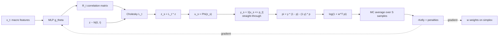

# Final Presentation — Technical Primer (plain English)

This document explains every technical concept used in the project, from scratch, in plain language. It is your study guide for the 10-minute presentation and the Q&A. Read it end-to-end at least once. Then re-read the sections your slide covers until you can explain them in one sentence without looking.

Companion document: `[docs/final_presentation_guide.md](final_presentation_guide.md)` — the slide-by-slide speaker guide.

---

## Table of contents

1. [The problem in plain English](#1-the-problem-in-plain-english)
2. [Prediction markets and Polymarket](#2-prediction-markets-and-polymarket)
3. [What a "portfolio" is in this project](#3-what-a-portfolio-is-in-this-project)
4. [How we pick the 40 markets](#4-how-we-pick-the-40-markets)
5. [The baseline: equal weight](#5-the-baseline-equal-weight)
6. [Performance metrics — Sortino, log-wealth, drawdown, turnover](#6-performance-metrics)
7. [Mean–Variance Optimization (MVO) — what we tried first](#7-meanvariance-optimization-mvo)
8. [The simplex and weight parameterization (softmax vs projected simplex)](#8-the-simplex)
9. [Online Gradient Descent (OGD) vs offline SGD](#9-ogd-vs-sgd)
10. [Walk-forward training and rolling windows](#10-walk-forward)
11. [Hyperparameter tuning — Optuna, Sobol vs Bayesian TPE](#11-hyperparameter-tuning)
12. [The Kelly criterion and log-wealth objective](#12-kelly)
13. [The dynamic Gaussian copula](#13-copula)
14. [Straight-through Bernoulli gradient estimator](#14-straight-through)
15. [L1 turnover penalty and why Adam handles it](#15-l1-turnover)
16. [Momentum pre-screening](#16-momentum)
17. [Macro and stock data integration (ETFs, VIX, risk-regime, topic→ticker)](#17-macro)
18. [Learnable market inclusion — Pod L](#18-pod-l)
19. [The stock-PM combined strategy](#19-stock-pm)
20. [Single-factor dominance — the diagnostic](#20-single-factor-dominance)
21. [Honesty post-hocs — bootstrap CI, fees, alpha-blend](#21-honesty-post-hocs)
22. [Glossary — one-line definitions](#22-glossary)
23. [How to build all the figures on your laptop](#23-build-figures)

---


## 1. The problem in plain English

**The question.** Can a smart optimizer beat "just split your money evenly across 40 prediction-market contracts" on risk-adjusted return?

**Why this is not obvious.** At first glance, *more optimization* should beat *no optimization*. But prediction markets have two quirks that make equal weight a very hard target:

- **Contracts settle to 0 or 1.** The payoffs are not smooth — each market is a coin flip with a probability encoded in its price. A portfolio of 40 coins does not average down the way a stock portfolio does.
- **Many contracts share one macro driver.** Forty "different" markets about the 2026 midterm election can all jump together when a single poll drops. You *think* you have 40 bets; you really have 1 or 2 bets repeated 40 times.

So the optimizer has to add value beyond what diversification counting (N = 40) already gives. Our finding: with the universe we have, it cannot — until we change the **objective** from Sortino to expected log-wealth (Kelly).

**One-sentence project summary.** *"We tried to beat equal-weight on 40 Polymarket contracts using constrained optimization, found that mean-variance cannot because the universe has essentially one risk factor, pivoted to a growth-optimal (Kelly) objective with a macro-conditioned correlation model that does beat baseline gross-of-fees, then stress-tested the result and found it is real but marginal, over-levered, and fee-fragile."*

---


## 2. Prediction markets and Polymarket

**A prediction market** is a venue where people trade contracts that pay $1 if a named event happens (say, *"Will the Fed cut rates in Dec 2025?"*) and $0 if it does not. The market price $p \in [0, 1]$ is the traders' collective probability estimate.

**Polymarket** is the largest crypto-native prediction-market venue. Contracts live on its CLOB (central limit order book), settle on-chain, and expose a public API (`gamma-api.polymarket.com` for market metadata, CLOB endpoints for price history).

**Why it is interesting for optimization:**

- The "return" on holding a YES token from time $t$ to $t+1$ is $r_t = (p_{t+1} - p_t) / p_t$. This is what our `baseline_timeseries.csv` rows contain.
- Returns are **highly non-Gaussian**: near expiration, the price collapses to 0 or 1 — a binary payoff with probability $p_T$.
- **Autocorrelation and clustering**: news events create step-changes; quiet periods are near-random walks.

For this project we ignore trading costs during training (gross-of-fees) but **post-hoc** penalize them when judging results — see §21.

---


## 3. What a "portfolio" is in this project

At each hourly bar $t$ you choose a weight vector $w_t = (w_{t,1}, \ldots, w_{t,N})$ with $w_{t,i} \ge 0$ and $\sum_i w_{t,i} = 1$. The number $w_{t,i}$ is the fraction of your current wealth you hold in market $i$. Constraints:

- **Non-negative** ($w_{t,i} \ge 0$) — we do not short on Polymarket.
- **Sum to one** — you are always fully invested.
- **Per-domain cap** — you cannot allocate more than $L_d$ to markets tagged to domain $d$ (election, sport, crypto, etc.). This is the *"differentiable domain cap"* constraint that motivates the project.
- **Per-market cap** — no single market gets more than $w_{\max}$.

The set of valid $w$ is the **simplex** $\Delta^{N-1}$ (see §8). All our optimizers live on this simplex and use Euclidean projection to stay there.

**Realized portfolio return:**

$$
R_t = \sum_i w_{t,i} \cdot r_{t,i} = w_t^\top r_t
$$

where $r_t$ is the per-market return vector. Summed over time, this gives cumulative wealth:

$$
W_T = W_0 \cdot \prod_{t=1}^T (1 + R_t)
$$

and **log-wealth**:

$$
\log W_T - \log W_0 = \sum_{t=1}^T \log(1 + R_t).
$$

Log-wealth is the metric the Kelly objective optimizes. Sortino ratio is the metric MVO targets. They are not the same thing — see §6 and §12.

---


## 4. How we pick the 40 markets

The universe of 40 markets is **re-selected every time we rebuild the dataset** by the function `_select_balanced_market_rows` in `[src/polymarket_data.py](../src/polymarket_data.py)` lines 223–274. The pipeline entry point is `[script/polymarket_week8_pipeline.py](../script/polymarket_week8_pipeline.py)` line 944 which sets `max_markets=40`.

**The nine-step recipe:**

1. Pull up to 60 active events from `gamma-api.polymarket.com/events`.
2. Flatten to **binary Yes/No markets only** (exactly two outcomes labeled "yes"/"no" with two CLOB token IDs). We track the Yes-side token.
3. Tag each event to a **domain** (e.g. `databricks`, `bundesliga`, `claude-5`) via `_derive_category_from_tags`.
4. **Drop admin / rewards slugs**: prefixes like `hide-from-new`, `parent-for-derivative`, `earn-`*, `pre-market`, `rewards-*` — these are not real trading markets.
5. Rank categories by **total liquidity** (sum of `market_liquidity` across markets in that category).
6. **Cap per-category at 2 markets** to force breadth.
7. **History filter**: require ≥20 CLOB price points and ≥24 days of trading history (auto-backoff to 14 days if strict fails).
8. **Round-robin fill** through the top categories until we hit 40 markets.
9. **Optional momentum screen** (pods G, S1, M-seed7): further narrow to the top-20 by 5-day return magnitude (see §16).

**Why this recipe?**

- **Breadth-biased**: the domain-exposure penalty (our main "cap per sector" constraint) needs meaningful domain diversity — otherwise the cap is vacuous.
- **Liquidity-gated**: thin markets have noisy / stale prices that contaminate the return series.
- **History-clean**: the walk-forward training needs enough bars per market.

Representative categories from our Week 9/11 builds: `databricks`, `economic-policy`, `anthropic`, `awards`, `california-midterm`, `bundesliga`, `2025-predictions`, `claude-5`, `gemini-3`, `champions-league`, `colombia-election`, `big-tech`, `france`, `formula1`, `colorado-midterm`, `epstein`, `ghislaine-maxwell`, `best-of-2025`, `bitcoin`, `ethereum`.

---


## 5. The baseline: equal weight

At every step, the baseline puts $w_{t,i} = 1/N$ in every available market. It **does nothing**. It does not learn, it does not trade (beyond whatever rebalancing equal-weight requires to maintain uniform proportions), and it has zero hyperparameters.

This is the **null hypothesis**. If the optimizer cannot beat equal-weight, the optimizer has no value.

On our 40-market holdout (11,429 hourly bars ≈ 16 months):


| Metric              | Baseline            |
| ------------------- | ------------------- |
| Sortino ratio       | +0.053              |
| Max drawdown        | −4.5%               |
| CAGR                | +37%                |
| Log-wealth          | +0.408              |
| Turnover (daily L1) | 0 (by construction) |


**The hard part**: +37% CAGR on a broad prediction-market portfolio is already a strong baseline. This is because 2025 was a year of heavy, news-driven convergence — many markets settled to 1 with prices starting at 0.5. Equal weight rode that wave for free.

---


## 6. Performance metrics — Sortino, log-wealth, drawdown, turnover

**Sortino ratio.** A risk-adjusted return measure. Numerator is the mean of the return series. Denominator is the *downside deviation* — the standard deviation computed using only the negative returns. Formula:

$$
\text{Sortino} = \frac{\mathbb{E}[R]}{\sqrt{\mathbb{E}[\min(R, 0)^2]}}
$$

Higher = better. It penalizes losses but not gains — unlike the plain Sharpe ratio which penalizes both.

**Why we use Sortino as the MVO objective**: portfolio optimization on binary-payoff assets should not punish upside volatility. When a contract rallies from 0.4 to 0.9 because news broke your way, that's exactly what you want — Sharpe's symmetric-variance penalty would discourage it.

**Log-wealth.** The cumulative log-return:

$$
\log\text{-wealth}*T = \sum*{t=1}^T \log(1 + R_t).
$$

This is what Kelly optimizes. It is the **long-horizon, compounded growth rate**. A strategy with high log-wealth compounds. A strategy with positive mean return but high variance can have *negative* log-wealth because $\log$ punishes fluctuations multiplicatively.

**Max drawdown (MaxDD).** The worst peak-to-trough loss:

$$
\text{MaxDD} = \min_t \left( \text{cumret}*t - \max*{s \le t} \text{cumret}_s \right)
$$

Always $\le 0$. Our baseline's MaxDD is a very kind −4.5% because 2025 had few sustained reversals.

**Turnover.** How much the portfolio churns between bars:

$$
\text{Turnover}*t =  w_t - w*{t-1} *1 = \sum_i |w*{t,i} - w_{t-1, i}|.
$$

High turnover is expensive: every unit of turnover gets scraped by fees and slippage. K10C had 0.107 average daily turnover — about 11% of the portfolio reshuffling every day. K10D cut this to 0.020 (∼5× reduction) without losing the headline edge.

---


## 7. Mean–Variance Optimization (MVO) — what we tried first

**The original MVO.** Markowitz (1952). Pick $w$ to maximize a linear combination of portfolio **mean** minus a quadratic **risk** term:

$$
\max_{w \in \Delta^{N-1}} \quad w^\top \bar r - \lambda w^\top \Sigma w
$$

where $\bar r$ is the estimated mean-return vector and $\Sigma$ is the estimated covariance matrix. Risk is quadratic in $w$. Mean is linear in $w$. Closed-form solution exists for the unconstrained case. This is classical textbook optimization.

**Our MVO is not pure Markowitz.** We replace the reward with a **mean–downside surrogate** that penalizes only downside variance:

$$
J_{\text{md}}(R) = \mathbb{E}[R] - \alpha_v \cdot \text{Var}(R) - \beta_d \cdot \mathbb{E}[\max(-R, 0)^2]
$$

and then add a stack of penalties:

$$
\mathcal{L}(w) = -J_{\text{md}}(w^\top r) + \lambda_\Sigma w^\top \Sigma w + \lambda_d \sum_d \max(0, S_d(w) - L_d)^2 + \lambda_c \sum_i \max(0, w_i - w_{\max})^2 - \lambda_e \left(-\sum_i w_i \log(w_i + \epsilon)\right)
$$

Reading the terms left to right:

- $-J_{\text{md}}$ — the negative of the mean–downside surrogate (we minimize, so negate to maximize).
- $\lambda_\Sigma w^\top \Sigma w$ — a covariance penalty that suppresses correlated bets.
- $\lambda_d \sum_d \max(0, S_d(w) - L_d)^2$ — the **domain overexposure penalty**: if total weight in domain $d$ exceeds its cap $L_d$, pay a quadratic price.
- $\lambda_c \sum_i \max(0, w_i - w_{\max})^2$ — the **concentration penalty**: no single market above $w_{\max}$.
- $-\lambda_e \cdot \text{entropy}$ — an **entropy bonus** encouraging diversified weight vectors.

It is still MVO in spirit because the reward is linear in $w$ and the risk is quadratic, on a convex feasible set. The loss is convex in $w$ for fixed hyperparameters. Solvable with gradient descent + projection (see §8).

**A big caveat.** We also blend the optimized weights with a uniform vector at a floor rate $\alpha \in [0, 1]$:

$$
\tilde w_t = (1 - \alpha) \cdot w_t + \alpha \cdot u, \quad u = (1/N, \ldots, 1/N).
$$

The `uniform_mix` hyperparameter $\alpha$ is typically between 1.5% and 7% in our best trials. This is a diversification floor that prevents the optimizer from ever fully committing to a single market.

---


## 8. The simplex and weight parameterization (softmax vs projected simplex)

**The simplex.** The set of valid portfolio weights:

$$
\Delta^{N-1} =  w \in \mathbb{R}^N : w_i \ge 0,\ \textstyle\sum_i w_i = 1 .
$$

For $N = 40$ this is a 39-dimensional slanted triangle sitting inside $\mathbb{R}^{40}$. All valid portfolios are points inside or on the boundary of this triangle.

**Two ways to keep an optimizer's iterates inside $\Delta^{N-1}$:**

### 8a. Softmax parameterization

You optimize an unconstrained logit vector $\ell \in \mathbb{R}^N$, and whenever you need weights you compute

$$
w_i = \frac{e^{\ell_i}}{\sum_j e^{\ell_j}}.
$$

**Consequences:**

- Every $w_i > 0$ by construction. You **cannot** set a weight to exactly zero.
- The parameterization is **smooth everywhere**. Gradient descent works cleanly.
- There is an implicit bias toward the **interior** of the simplex. Soft-max is mathematically equivalent to mirror descent with a KL-divergence regularizer — meaning the parameterization itself softly encourages diversification even if no penalty in the loss does.


### 8b. Projected simplex parameterization (what we actually used)

You optimize the weight vector $w \in \mathbb{R}^N$ **directly** and after every Adam step you project back onto $\Delta^{N-1}$:

$$
w \leftarrow \text{proj}*\Delta(w) = \arg\min*{v \in \Delta^{N-1}}  v - w _2^2.
$$

The projection is computed by a sort-based $O(N \log N)$ algorithm (Held & Wolfe 1974; Duchi et al. 2008):

1. Sort $w$ in descending order: $\mu_1 \ge \mu_2 \ge \ldots \ge \mu_N$.
2. Find the largest $\rho$ such that $\mu_\rho + \frac{1}{\rho}(1 - \sum_{k=1}^\rho \mu_k) > 0$.
3. Set threshold $\theta = \frac{1}{\rho}(\sum_{k=1}^\rho \mu_k - 1)$.
4. Project: $w_i \leftarrow \max(w_i - \theta, 0)$.

**Consequences:**

- Weights can reach **exactly zero**. The projection thresholds negative coordinates. The optimizer is free to *drop* a market from the portfolio.
- **No implicit bias** from the parameterization. Every diversification pressure is *explicitly* in the loss.
- The `uniform_mix` floor $\alpha$ is doing real work — it keeps weights off the boundary so the entropy bonus $-\sum w_i \log(w_i + \epsilon)$ has a well-defined gradient.


### 8c. Why projected simplex matters for our MVO failure narrative

We ran projected simplex in both MVO and Kelly. Every pod's `*_best_metrics.json` on branches `cloud-runs-B`, `cloud-runs-F2`, `cloud-runs-G2`, `cloud-runs-I4`, `cloud-runs-Q5`, `cloud-runs-S1`, `cloud-runs-K10C` reports `"weight_parameterization": "projected_simplex"`.

The **implementation** lives at `[src/constrained_optimizer.py](../src/constrained_optimizer.py)` line 304 (`_project_to_simplex`) and line 346 (`_project_parameter_vector_inplace`). The Kelly pipeline uses the same routine at `[src/kelly_copula_optimizer.py](../src/kelly_copula_optimizer.py)` line 163.

**The dataclass default is "softmax"** but the week 8 pipeline explicitly overrides it at `[script/polymarket_week8_pipeline.py](../script/polymarket_week8_pipeline.py)` line 990:

```python
weight_parameterization="projected_simplex",  # switch to "projected_simplex" to enable PGD-style updates
```

**Why this is important for the story:** our MVO pods collapsed to "near-equal-weight" (max per-domain allocation of 0.0254 vs uniform 1/40 = 0.0250). If we had used softmax, someone could argue *"the parameterization is just biasing you toward the interior"*. Because we used projected simplex, **the optimizer was free to concentrate; it simply chose not to**. That strengthens the "MVO genuinely cannot find an edge on this data" claim.

---

## 9. Online Gradient Descent (OGD) vs offline SGD

This is the single biggest design choice in the project. Both MVO and Kelly train via OGD, not offline SGD.

### 9a. What offline SGD is (what we rejected)

Classical stochastic gradient descent assumes:

1. Data is IID — independent and identically distributed — samples from a fixed distribution $p(x, y)$.
2. You have all the data up front.
3. You train by shuffling the data, drawing minibatches, taking gradient steps, and looping over epochs.
4. Once training is done, you deploy a fixed model that never updates again.

**Why this doesn't work for prediction markets:**

- **The return distribution is not fixed.** Markets *expire* — every contract has a finite life, converges to $0, 1$ at resolution, then gets replaced. The distribution is literally different in November than in January.
- **Shuffling destroys the time structure.** Autocorrelation within a market and dynamic cross-market correlation are the signals we want to learn. Shuffling minibatches obliterates them.
- **"Deploy and freeze" doesn't match how production would work.** On a real Polymarket deployment you receive a new bar and must decide — not "retrain overnight, deploy tomorrow".

### 9b. What OGD is (what we actually use)

Online gradient descent (Zinkevich 2003) is designed for the **sequential decisions** setting. At each time step $t$:

1. Look at a rolling window of the last $W$ bars of data.
2. Take `steps_per_window` (3–5) Adam updates on the current weight vector using this window.
3. Project back onto the simplex.
4. Commit $w_t$ as your decision for step $t$.
5. **Observe the realized return** $R_t = w_t^\top r_t$.
6. Move to step $t+1$. **State persists** — parameters are not re-initialized.

The performance guarantee is not about "generalization to new IID samples". It is about **regret**:

$$
R_T = \sum_{t=1}^T \ell_t(w_t) - \min_{w \in \Delta^{N-1}} \sum_{t=1}^T \ell_t(w).
$$

Regret compares what you did against the **best fixed portfolio in hindsight**. For convex losses on a bounded convex set with bounded gradients, Zinkevich proves $R_T = O(G\sqrt{T})$. This is the relevant bound for our problem: we care about cumulative realized wealth, not IID test loss.

### 9c. Code locations

- **Outer OGD loop** — `[src/constrained_optimizer.py](../src/constrained_optimizer.py)` line 447: `for t in range(rolling_window, returns_matrix.shape[0]):`. One iteration = one holdout bar.
- `**steps_per_window` Adam updates per bar** — `[src/constrained_optimizer.py](../src/constrained_optimizer.py)` line 504.
- **Projection onto the simplex after each step** — line 304 (MVO) and `[src/kelly_copula_optimizer.py](../src/kelly_copula_optimizer.py)` line 605 (Kelly).
- **Kelly inner MC stochastic gradient** — `[src/kelly_copula_optimizer.py](../src/kelly_copula_optimizer.py)` line 577 comment: *"Resample epsilon every inner step (true SGD on the MC estimator)"*. Kelly is **OGD outside, SGD inside**.
- **Module docstrings name this explicitly** — `[src/constrained_optimizer.py](../src/constrained_optimizer.py)` line 1: *"First-pass constrained OGD/SGD experiments for domain-aware allocation."*

### 9d. Adam is itself an OGD algorithm

We use Adam (Kingma & Ba 2014) as the per-step update rule. Adam was *derived* as an online convex optimization algorithm — Theorem 4.1 of the original paper gives an $O(\sqrt{T})$ regret bound. So "Adam inside OGD" is not a hack — it is the intended composition. We use Adam rather than vanilla SGD because:

- **Per-coordinate adaptive step sizes** handle the very different scales of portfolio weights (∼1/40) vs copula MLP parameters (random-init scale). In the Kelly pipeline we update both in a single `optimizer.step()` call.
- **Moment smoothing** (Adam's exponentially-weighted first and second gradient moments) absorbs the subgradient kink of the L1 turnover term automatically. A plain SGD would oscillate at the kink.

### 9e. "Going away from SGD" — the disambiguation

When we say *"we went away from SGD"*, we do **not** mean we stopped using stochastic gradients. The Kelly pipeline's inner loop is *literally* stochastic because we resample MC noise every inner step. What we replaced was the **offline IID-batch training protocol** (shuffle → minibatch → epoch) with the **online rolling-window protocol** that matches how prediction markets generate data.

**The accurate one-liner:** *"We use Adam in an online rolling-window loop (OGD) with stochastic Monte-Carlo gradients inside the Kelly objective — not offline minibatch SGD over a shuffled IID dataset."*

---

## 10. Walk-forward training and rolling windows

**Rolling window.** At each holdout bar $t$, we train only on the window $[t - W, t)$. Typical $W \in 24, 48, 96$ bars. The window slides forward as $t$ advances.

**Walk-forward tuning.** When picking hyperparameters, we split the pre-holdout portion of the dataset into multiple folds, each with its own training and validation segment, and compute the objective on each fold's validation segment. The final score is the mean or median across folds. This is the time-series analogue of k-fold cross-validation — but with a one-way time arrow so you never leak future data into the past.

**Why not a single train/test split?** Because the walk-forward CV score is more robust to regime-specific overfitting. A hyperparameter set that only wins in one quiet month will lose on other folds.

**Holdout.** The final 20% of the timeseries is the *holdout*. It is never used for tuning. All headline numbers ("K10C beats baseline by +0.46 log-wealth") come from this unseen holdout.

---

## 11. Hyperparameter tuning — Optuna, Sobol vs Bayesian TPE

### 11a. What hyperparameter tuning is

Our optimizer has ~14 knobs — `learning_rate`, `rolling_window`, `domain_limit`, `max_weight`, `uniform_mix`, `concentration_penalty_lambda`, `covariance_penalty_lambda`, `entropy_lambda`, `variance_penalty`, `downside_penalty`, `regime_k`, `lambda_macro_explicit`, `turnover_lambda`, `mc_samples`. Each has a range. A "trial" = one specific setting of all 14 knobs; we train the model with those knobs and measure walk-forward validation score. Hyperparameter tuning picks the best trial.

### 11b. What we use: QMCSampler (scrambled Sobol) + MedianPruner

The sampler lives at `[src/constrained_optimizer.py](../src/constrained_optimizer.py)` line 1906 and `[src/kelly_copula_optimizer.py](../src/kelly_copula_optimizer.py)` line 948:

```python
sampler = optuna.samplers.QMCSampler(
    qmc_type="sobol",
    scramble=True,
    seed=cfg.seed,
)
```

And the pruner lives right below: `optuna.pruners.MedianPruner(n_startup_trials=3, n_warmup_steps=n_warmup_steps)`.

**What "QMC" and "Sobol" mean in one paragraph.** A Sobol sequence is a **deterministic, low-discrepancy point set** — it fills the unit cube $[0, 1]^d$ more uniformly than random samples do. "Low-discrepancy" means the worst-case gap between the empirical density and the uniform density shrinks at rate $O((\log N)^d / N)$, compared to $O(1/\sqrt{N})$ for random. With **scrambling**, Sobol becomes a randomized quasi-Monte Carlo sample with the same variance-reduction benefit but a randomized realization (so we get CI-style error estimates). The seeded scramble makes the whole thing reproducible.

### 11c. What we started with: TPE (Bayesian)

We originally used Optuna's `TPESampler` — Tree-structured Parzen Estimator, a Bayesian optimization algorithm. TPE fits two density estimators to past trial scores, one for the "good" trials and one for the "bad" trials, then samples new points where the ratio of good-density to bad-density is high.

**The switch.** Commit `54d6754` on April 16, 2026 with message *"changing to quasi-random optimization instead of bayesian optimization"* replaced:

```python
# Before
sampler=optuna.samplers.TPESampler(seed=cfg.seed),
# After
sampler=optuna.samplers.QMCSampler(seed=cfg.seed, qmc_type="sobol"),
```

The module docstring at `[src/constrained_optimizer.py](../src/constrained_optimizer.py)` lines 1626–1631 explains directly:

> *"Drop-in replacement for run_experiment_grid that uses Optuna's quasi-Monte Carlo sampler (low-discrepancy Sobol sequence) with MedianPruner for early stopping of unpromising trials during walk-forward validation folds. This avoids TPE/Bayesian overhead in very high-dimensional conditional spaces."*

### 11d. Why Sobol beats TPE on our problem — five reasons

1. **High-dim conditional space.** Our hyperparameters are *conditional*: `regime_k` only exists when `macro_mode ∈ {rescale, both}`; `lambda_macro_explicit` only exists when `macro_mode ∈ {explicit, both}`. TPE builds Parzen estimators over hyperparameter samples — conditional branches break the density-estimator's assumptions. GP-based Bayesian optimization (the other common choice) has the same problem.
2. **Cheap trial budget.** We run ~100 trials over a ~14-dim cube. Sobol's star-discrepancy $O((\log N)^d / N)$ guarantees better provable coverage than TPE's early-trial random exploration. 100 points is simply not enough to fit a useful Bayesian surrogate in 14 dimensions.
3. **Embarrassingly parallel.** Sobol emits deterministic trial specifications — all 100 trials can be drawn up front and run concurrently with no inter-trial dependency. TPE and GP-BO are **sequential by construction** (each new trial depends on the surrogate fitted to previous trials). We run `optuna_n_jobs=4` on the laptop and higher on cloud pods — Sobol fits this threading model cleanly.
4. **Non-smooth, noisy objective.** Walk-forward Sortino is noisy across folds. A Bayesian surrogate fitted to that noise may mislead the search. We keep `MedianPruner` to early-stop unpromising trials without needing a surrogate model.
5. **Seed-reproducibility across multi-seed replications.** `scramble=True` + seeded yields deterministic Sobol draws — critical for our multi-seed pods on branches `cloud-runs-A-seed{7,42,123}`, `cloud-runs-G-seed{42,123}`, `cloud-runs-S4`. Bayesian samplers have a non-deterministic exploration phase that would confound seed replication.

**The one-liner:** *"With 100 trials over 14 conditional dimensions, Bayesian's surrogate cannot learn enough to help; Sobol just covers the cube better and runs in parallel."*

### 11e. MedianPruner

Separately from the sampler, we keep a **pruner** that early-stops trials that underperform. At each walk-forward fold, if a trial's intermediate Sortino is below the median of all prior trials at the same fold, we kill it. This gives us the speed-up of early stopping *without* the fragility of a fitted surrogate.

---

## 12. The Kelly criterion and log-wealth objective

### 12a. The intuition

Kelly is the **growth-optimal** betting rule. If you can bet a fraction $f$ of your wealth repeatedly on an edge-positive gamble, the fraction that maximizes your long-horizon geometric growth rate is the one that maximizes $\mathbb{E}[\log(1 + f \cdot X)]$ where $X$ is the per-bet return. Too little $f$ and you grow slowly. Too much $f$ and you go bust with high probability. Kelly finds the sweet spot.

Why $\log$? Because wealth compounds multiplicatively. Long-horizon wealth is $W_0 \cdot \prod_t (1 + R_t)$. Maximizing the log of a product = maximizing a sum of logs. So $\mathbb{E}[\log(1 + R)]$ is the correct objective when you plan to reinvest.

### 12b. Our Kelly objective

For a portfolio $w$ over $N$ binary-payoff markets with per-step payoff vector $\pi$, we maximize:

$$
J_K(w) = \mathbb{E}\left[ \log(1 + w^\top \pi) \right].
$$

The expectation is over the joint distribution of $\pi$. Since $\pi_i \in -p_i, 1 - p_i$ (you lose your stake $p_i$ or gain $1 - p_i$), this requires modeling the **joint Bernoulli structure** of the $N$ binary outcomes — which is where the copula comes in (§13).

### 12c. Why not MVO?

Mean-variance is a **local approximation** of Kelly when returns are small and Gaussian. Neither assumption holds for Polymarket:

- Returns are not small — near expiry, a contract can swing 50+% in a day.
- Returns are not Gaussian — they are binary at resolution.

On these assets, Kelly captures **geometric** (compounded) growth correctly while Sortino and MVO optimize an **arithmetic-mean-minus-variance** proxy that can be catastrophically wrong at high return magnitudes. This is the theoretical reason we pivoted.

### 12d. Code location

The Kelly pipeline is `[src/kelly_copula_optimizer.py](../src/kelly_copula_optimizer.py)`. The loss assembly is lines 597–605:

```python
loss = (
    -kelly
    + (turnover_lambda + fee_rate) * turnover
    + concentration_penalty_lambda * concentration_penalty
    + dd_penalty * downside_mc
)
loss.backward()
optimizer.step()
_project_parameter_vector_inplace(params, available_mask)
```

---


## 13. The dynamic Gaussian copula

### 13a. Why we need a copula

To compute $\mathbb{E}[\log(1 + w^\top \pi)]$ we need the joint distribution of the binary outcomes $y = (y_1, \ldots, y_N)$. We know the marginals (the market prices $p_i$ tell us $\Pr(y_i = 1) = p_i$). We do **not** know the joint — that is, we do not know how correlated the outcomes are.

A **copula** is a mathematical tool for building a joint distribution out of its marginals plus a correlation structure. The **Gaussian copula** is the simplest: you sample a Gaussian vector $z \sim \mathcal{N}(0, R)$ with correlation matrix $R$, convert each coordinate to a uniform via the Gaussian CDF ($u_i = \Phi(z_i)$), and threshold: $y_i = \mathbf{1}u_i \le p_i$.

Marginally, this gives $\Pr(y_i = 1) = \Pr(u_i \le p_i) = p_i$ (because $u_i$ is uniform on $[0, 1]$). Jointly, the correlation structure $R$ controls how the $y$'s move together.

### 13b. Why *dynamic*

A static correlation matrix is one number per pair of markets, estimated from history. It says "these two markets correlate 0.3, always." But prediction-market correlation is **regime-dependent**. On a high-VIX day, everything might move together. On a quiet day, each market walks independently.

We make $R$ depend on time via a **small multilayer perceptron (MLP)**. At each step we feed in a macro-feature vector $x_t = (\text{SPY return}_t, \text{QQQ return}_t, \text{BTC return}_t)$ and the MLP outputs the upper-triangle of $R_t$:

$$
R_t = g_\theta(x_t).
$$

So the correlation structure learned by the MLP is a **function of market conditions**. On volatile macro days, the MLP can predict higher off-diagonal entries (everything moves together); on calm days, lower.

### 13c. Gradient flow through the copula

Here's the architecture end to end:




We generate $S$ Monte-Carlo samples at each step. The expectation is estimated as a sample mean. Gradients flow backward through:

- The MC average (trivial — it's linear in its inputs).
- The log and payoff functions (differentiable).
- **The Bernoulli threshold** (not differentiable — see §14).
- The Gaussian CDF $\Phi$ (differentiable, built into PyTorch).
- The Cholesky factorization (differentiable when $R$ is positive-definite).
- The MLP $g_\theta$ (differentiable).

Gradient flow hits both the **portfolio weights $w$** (directly, through the $w^\top \pi$ term) and the **MLP parameters $\theta$** (through the dependence of $R$ on $\theta$). We update them **simultaneously** in a single Adam step on both parameter groups. This is the "joint Adam-OGD over $(w, \theta)$" referenced in `[docs/week10_kelly_academic_summary.md](week10_kelly_academic_summary.md)` §4.

### 13d. Why this is non-convex

Kelly's $\log(1 + w^\top \pi)$ is **concave in $w$ for fixed $\theta$** (so MVO's convex machinery would still work). But the joint problem is **non-convex** because:

1. The MLP $g_\theta$ is a non-linear function of $\theta$.
2. $\Phi$ is nonlinear.
3. The positive-definite-shrinkage fallback we use when the MLP produces a near-singular $R_t$ introduces a kink.
4. The straight-through Bernoulli is a biased gradient estimator.

Stacking these means the loss landscape has many local minima, saddle points, and regions of zero gradient. This is the precise source of the severe non-convexity required by the project specification.

### 13e. PD-fallback

A raw MLP output may not give a valid positive-definite correlation matrix. We use a shrinkage fallback: if Cholesky fails, shrink $R_t$ toward the identity:

$$
R_t \leftarrow (1 - \alpha_\text{shrink}) R_t + \alpha_\text{shrink} I.
$$

K10C had ~170k such fallback events across the training run, logged in `kelly_metrics.pd_fallback_steps`.

---


## 14. Straight-through Bernoulli gradient estimator

The step from $u_s$ to $y_s = \mathbf{1}u_s \le p_t$ is **not differentiable** — it's a hard threshold with zero gradient almost everywhere and an infinite spike at the threshold. If we used this in the forward pass and let PyTorch autograd handle it, gradients would be identically zero and the MLP would never train.

The **straight-through estimator** (Bengio et al. 2013) is a standard hack:

- **Forward pass**: $y = \mathbf{1}u \le p$ (hard Bernoulli).
- **Backward pass**: pretend the gradient is $\frac{\partial}{\partial p}\sigma\left(\frac{p - u}{\tau}\right)$ where $\sigma$ is the logistic function and $\tau$ is a temperature (e.g. 0.1).

This gives a **biased** but **low-variance** gradient. Biased = it does not converge to the true gradient in expectation. Low-variance = with enough MC samples, the overall optimization direction is correct. In practice this is the standard trick for learning through discrete sampling and it works well.

**Code reference:** `[src/kelly_copula_optimizer.py](../src/kelly_copula_optimizer.py)` section on Bernoulli; `[docs/week10_kelly_academic_summary.md](week10_kelly_academic_summary.md)` §3.

---


## 15. L1 turnover penalty and why Adam handles it

We add a term to the Kelly loss:

$$

- \lambda_\text{turn} \cdot  w_t - w_{t-1} _1.
$$

This is the L1 norm of the per-step weight change. It penalizes every unit of weight that moves between bars. Turnover = trading = fees = slippage.

**Why L1 specifically?** L1 induces **sparsity in the changes** — the optimizer prefers to leave many weights untouched and reallocate only a few, rather than nudging everything by a small amount. This matches the trading reality: a few decisive trades > lots of micro-trades.

**The L1 kink.** L1 is non-smooth at zero — the function $|x|$ has a corner at $x = 0$. Classical gradient descent oscillates at that corner. Vanilla SGD would need a **proximal-point** step to handle it cleanly.

**Why Adam just works anyway.** Adam maintains exponentially-weighted estimates of the first and second moments of the gradient, per coordinate:

- $m_t = \beta_1 m_{t-1} + (1 - \beta_1) g_t$
- $v_t = \beta_2 v_{t-1} + (1 - \beta_2) g_t^2$

When the subgradient at the kink oscillates between $+1$ and $-1$ across inner steps, $m_t$ averages out near zero and the step size shrinks automatically. No proximal machinery needed. This is a well-known practical fact; see `[docs/week10_kelly_academic_summary.md](week10_kelly_academic_summary.md)` §5.

### 15a. Why K10D added this and what it fixed

K10C (no turnover penalty) had an average daily turnover of 0.107 — about 11% of the portfolio re-shuffling every bar. At 10 bps of fees, this is catastrophic. K10D added the L1 turnover term and Optuna-tuned $\lambda_\text{turn}$. Result: turnover dropped from 0.107 → 0.020 (~5× reduction), log-wealth Δ held at +0.27 (vs K10C's +0.46). Directional fix confirmed.

---


## 16. Momentum pre-screening

A simple universe-reduction trick: **before** running the optimizer, compute each market's past 5-day return magnitude $|r_{t-5:t}|$ and keep only the top 20. The optimizer then operates on a 20-market universe instead of 40.

**The hypothesis:** markets that have moved a lot recently may continue to move (momentum factor), giving the optimizer better signal-to-noise. Markets that have been flat have nothing to say.

**CLI:** `--momentum-screening --momentum-top-n 20 --momentum-lookback-days 5`. Implementation in the `momentum-lever` branch and merged into the main pipeline.

**Results:**

- **MVO + momentum (pods G, H, S1):** Sortino Δ +0.008 to +0.016 — positive but within the ±0.036 seed-noise band. Small lift, not statistically decisive.
- **Kelly + momentum (Pod M-seed7):** Sortino Δ +0.027, log-wealth Δ +0.22, 75.8% bootstrap-positive. The cross-term no prior pod had run.
- **Replicated across 3 seeds (Option A on `direction-B`):** when combined with baseline-shrinkage and macro=both, the 3-seed mean Δ = −0.0169 ± 0.0003 — all three seeds negative. Proves negative results replicate tightly.

---


## 17. Macro and stock data integration

We tried four different ways to inject outside market data into the optimizer. None of them beat equal-weight by a wide margin on their own, but they are important parts of the story.

### 17a. Macro features as direct optimizer input (pods B, C, D, F, Q, S)

The `macro_integration` flag in `[src/constrained_optimizer.py](../src/constrained_optimizer.py)` takes values `{none, rescale, explicit, both, joint}`. What each mode does:

- **rescale**: SPY/VIX/ETF z-scores reshape the concentration and variance penalty coefficients *on the fly*. When risk-on (low VIX), allow more concentration; when risk-off, tighten caps. Code at lines 459–495.
- **explicit**: Macro returns are appended to the feature vector and enter the loss via an additive $J_\text{macro}$ term with Optuna-tuned $\lambda_\text{macro-explicit}$.
- **both**: rescale + explicit.
- **joint**: Optuna also tunes the macro_mode itself.

**Result:** Sortino Δ ranged from −0.02 to −0.06. None beat baseline.

### 17b. ETF-tracking loss (pods C, D, F)

A separate loss term that pulls portfolio weights toward a fixed SPY/QQQ/XLE mix:

$$

- \lambda_\text{etf} \cdot  w - w_\text{etf} _2^2.
$$

**Result:** in pod C, the per-hour breakdown revealed:

- During US equity trading hours (9:30am–4pm ET): Sortino Δ_open = **+0.055** (the ETF tilt actually helps when US equities are active).
- During closed hours: Sortino Δ_closed = **−0.089** (the tilt is actively harmful when equities are not moving).
- Closed bars outnumber open bars 5.7 : 1, so the weighted total Δ is negative.

This is documented in `[docs/week9_cross_pod_synthesis.md](week9_cross_pod_synthesis.md)` §3 and is one of the most interesting asymmetries in the project.

### 17c. The stock-PM combined strategy (branch `stock-PM-combined-strategy`)

Two listed-equity layers added on top of the MVO optimizer:

**1. Risk-regime z-score.** Combines SPY, ^VIX, XLE, XLV, XLF, QQQ, XLK, and the defensive basket (WMT, COST, LLY, PG, KO) into a composite risk-on / risk-off signal. This z-score dynamically reshapes `max_domain_exposure` and the concentration penalty — risk-on loosens caps, risk-off tightens.

**2. Domain→ticker topic map.** Each Polymarket domain is mapped to a specific equity ticker:

- `finance` → XLF
- `crypto` → IBIT
- `science` → XLK
- (default) → SPY

The mapping provides a **positive-part floor** — if the mapped ticker has done well, the corresponding domain's allocation cannot be fully zeroed — and an **optional** λ-scaled signal term that tilts weights toward domains whose aligned ticker is up.

**Result (Week 17 on that branch):** Sortino Δ negative; best Optuna trial turned the equity-signal λ off entirely (`equity_signal_lambda = 0`). The risk-regime layer still governed concentration caps. The optimizer itself decided the topic→ticker channel wasn't worth using.

### 17d. The Kelly copula uses macro data differently

The dynamic Gaussian copula (§13) takes $(\text{SPY}_t, \text{QQQ}_t, \text{BTC}_t)$ as exogenous features, but **not** as a tracking target or as a loss-additive term. Instead it uses them as **conditioning signals for the risk model** — the macro features inform the correlation matrix shape. This is the "right" way to use macro data in our problem: not as a target, but as a regime indicator for the dependency structure.

### 17e. One-liner for Q&A

*"Macro and listed-equity data did change the optimizer's decisions — but not in a way that beat equal-weight, except when used as a risk-model input inside the Kelly copula."*

---


## 18. Learnable market inclusion — Pod L (branch `learnable-selection`)

**What it is:** a meta-optimization where the **universe itself** is a differentiable decision variable. Instead of hand-picking which 20 markets are in via a momentum screen, the optimizer learns **per-market inclusion gates**:

$$
g_i = \sigma(\tilde g_i) \in (0, 1), \quad \tilde g_i \in \mathbb{R}.
$$

The gate $g_i$ replaces the binary `available_mask`. A **commitment penalty** drives $\sum_i g_i \to k_\text{target} = 15$, so the optimizer converges on a target number of active markets. Gates train jointly with weights under the same Adam-OGD loop.

**New hyperparameters:** `target_k`, `commitment_penalty_lambda`, `inclusion_entropy_lambda`, `inclusion_learning_rate`.

**Result (`docs/direction_A_results.md` on that branch):**

- Full 40-market universe, learnable inclusion gates: Sortino Δ **−0.0172**, 95% CI [−0.069, +0.023], 23% seeds positive.
- Compare to hand-picked top-20 momentum (Pod G): Δ +0.0339.

**Interpretation:** the added flexibility **overfits** the walk-forward tuning set. The hand-picked momentum screen generalizes better because it encodes a strong prior (recently-moving markets). Learnable inclusion has no such prior and the Optuna search simply cannot find a robust gate structure in the few hundred trials budgeted.

**Why it's in the story:** the most aggressive meta-optimization experiment we ran. It fails — and that failure is informative. When the data has essentially one risk factor (§20), adding learnable structure cannot manufacture diversification from thin air.

---


## 19. The stock-PM combined strategy

Already covered in §17c. Key takeaway: the most elaborate macro/ETF integration we built — risk-regime overlay + domain→ticker map — did not beat baseline. The Optuna best trial set the equity-signal λ to zero. Branch: `origin/stock-PM-combined-strategy`. Reference: `[docs/week17_diagnostics_report.md](week17_diagnostics_report.md)` on that branch.

---


## 20. Single-factor dominance — the diagnostic

Across all our MVO pods we computed the **principal component analysis** of the returns covariance matrix. The top eigenvalue's share of total variance is:


| Pod | Top eigenvalue share |
| --- | -------------------- |
| B   | 0.83                 |
| C   | 0.84                 |
| F   | 0.86                 |


**What this means in plain English:** 83–86% of the co-movement across all 40 markets can be explained by a single common factor. The other 39 principal components collectively explain only 14–17%.

**Why this kills MVO:** mean-variance optimization finds its edge by **exploiting differential risk-return across multiple independent factors**. When there is effectively one risk factor, there is nothing to trade off against — every portfolio loads on the same factor, so equal-weight is already close to optimal.

**This is the structural reason MVO cannot beat baseline.** Not a tuning issue, not a parameterization issue — a property of the universe itself. Reference: `[docs/week9_cross_pod_synthesis.md](week9_cross_pod_synthesis.md)` §4.2.

---


## 21. Honesty post-hocs — bootstrap CI, fees, alpha-blend

K10C (Kelly + dynamic copula) beat baseline by +0.46 log-wealth on the holdout. Before declaring victory, we ran three post-hoc stress tests:

### 21a. Circular-block bootstrap confidence interval

Standard bootstrap assumes IID samples — which our autocorrelated time series is not. The **circular block bootstrap** (Politis & Romano 1992) resamples *contiguous blocks* of length $\ell$ (we use $\ell = 24$) with wrap-around at the endpoints. This preserves short-range temporal dependence.

We resample 1000 times, compute the K10C vs baseline log-wealth delta on each resample, and take the 2.5% and 97.5% quantiles.


| Strategy | Gross Δ | Bootstrap 95% CI | Pr(Δ > 0) | z         |
| -------- | ------- | ---------------- | --------- | --------- |
| K10A     | +0.18   | [−0.24, +0.52]   | 0.68      | +0.88     |
| K10B     | +0.23   | [−0.15, +0.59]   | 0.71      | +1.12     |
| K10C     | +0.46   | [+0.005, +0.973] | 0.975     | **+1.91** |


K10C is the only pod whose CI excludes zero. But only barely — z = +1.91, just below the conventional 1.96 threshold. The edge is real but marginal.

### 21b. Fee-ranking ladder

We re-evaluate each Kelly pod after deducting various per-bar fee rates. Source: `[data/processed/round7_fee_ranking.md](../data/processed/round7_fee_ranking.md)`.


| Fee (bps) | K10A Δ | K10B Δ | K10C Δ    |
| --------- | ------ | ------ | --------- |
| 0         | +0.18  | +0.23  | +0.46     |
| 10        | −0.05  | +0.14  | **−0.76** |
| 50        | −0.40  | −0.18  | −4.10     |
| 200       | −1.50  | −0.95  | −15.3     |


**Break-even fees** (the fee rate at which Δ = 0):

- K10A: 5.60 bps
- K10B: 10.93 bps
- K10C: **3.76 bps**

Real Polymarket fees are well above 3.76 bps. K10C's edge is destroyed by realistic friction. K10B's edge survives longer — but K10B is the *more conservative* pod, confirming the general principle "more aggressive optimization = less fee-robust."

### 21c. Fractional Kelly (α-blend)

A classical result: Full Kelly maximizes long-run growth but is **over-levered** — too risky. **Fractional Kelly** scales the Kelly weights by a factor $\alpha \in [0, 1]$ and puts the rest in cash (or baseline):

$$
w^{(\alpha)} = \alpha \cdot w_\text{Kelly} + (1 - \alpha) \cdot w_\text{baseline}.
$$

We sweep $\alpha$ on K10C's holdout. Source: `[data/processed/week10_kelly_C_alpha_blend.csv](../data/processed/week10_kelly_C_alpha_blend.csv)`.

The Sortino-maximizing α is **≈ 0.60** (not 1.0). At α = 0.5, log-wealth drops to 75% of full Kelly but max drawdown shrinks from −11.7% to −7.6%. This confirms K10C is over-levered — which is exactly what the classical theory predicts when the underlying edge estimate $\hat \mu$ is noisy.

### 21d. Synthesis

Three post-hocs, three warnings:

- **Statistical significance**: marginal (z ≈ 1.9)
- **Fee robustness**: destroyed at realistic fees (break-even 3.76 bps)
- **Leverage**: over-levered (α* ≈ 0.60)

K10D (turnover-penalized Kelly) and Pod M-seed7 (Kelly × momentum) partially address these. No single pod ships a deployable strategy; the direction is directionally correct.

---


## 22. Glossary — one-line definitions


| Term                           | One-line definition                                                                                            |
| ------------------------------ | -------------------------------------------------------------------------------------------------------------- |
| **Adam**                       | A per-coordinate adaptive-learning-rate variant of SGD; used inside every OGD step.                            |
| **Baseline**                   | Equal-weight portfolio $w_i = 1/N$. Our null hypothesis.                                                       |
| **Bootstrap (circular-block)** | Resampling technique for time-series that preserves short-range autocorrelation by sampling contiguous blocks. |
| **CAGR**                       | Compound annual growth rate — annualized log-wealth converted back to simple return.                           |
| **Cholesky**                   | Factorization $R = L L^\top$ used to sample Gaussian vectors with correlation $R$.                             |
| **Constrained**                | Our optimizer's output (MVO, Kelly, etc.), to distinguish from the baseline.                                   |
| **Copula**                     | A joint distribution built from marginals plus a correlation structure.                                        |
| **Domain cap**                 | Upper bound on total weight in any one event-category; differentiable quadratic penalty.                       |
| **Drawdown (MaxDD)**           | Worst peak-to-trough cumulative loss.                                                                          |
| **Entropy bonus**              | Negative-entropy penalty that encourages diversified weight vectors.                                           |
| **ETF tracking**               | Loss term pulling portfolio toward a fixed SPY/QQQ/XLE mix.                                                    |
| **Gamma-API**                  | Polymarket's public metadata endpoint (`gamma-api.polymarket.com`).                                            |
| **Holdout**                    | Last 20% of timeseries; never used in tuning; all headline numbers report holdout.                             |
| **Kelly**                      | Growth-optimal betting rule maximizing $\mathbb{E}[\log(1 + R)]$.                                              |
| **L1 turnover**                | Penalty $\lambda |w_t - w_{t-1}|_1$; induces sparse trade updates.                                             |
| **MaxDD**                      | Same as drawdown.                                                                                              |
| **MedianPruner**               | Optuna early-stopping rule: kill trials below the per-fold median.                                             |
| **MLP**                        | Multilayer perceptron; tiny neural network producing the copula correlation.                                   |
| **Momentum screen**            | Universe filter: keep top-20 by past 5-day return magnitude.                                                   |
| **MVO**                        | Mean–Variance Optimization (Markowitz 1952); our first-pass optimizer.                                         |
| **OGD**                        | Online Gradient Descent (Zinkevich 2003); our training protocol.                                               |
| **Optuna**                     | Hyperparameter-optimization framework; our search engine.                                                      |
| **PCA**                        | Principal component analysis; we use it to measure single-factor dominance.                                    |
| **PD fallback**                | Shrinkage towards identity when the MLP emits a near-singular $R_t$.                                           |
| **Pod**                        | A single cloud-run experiment, branch-isolated.                                                                |
| **Projected simplex**          | Weight parameterization — optimize $w$ directly, project after each step.                                      |
| **QMCSampler**                 | Optuna's Sobol quasi-Monte-Carlo trial sampler.                                                                |
| **Risk-regime overlay**        | VIX/ETF-based signal that dynamically reshapes concentration caps.                                             |
| **Sobol sequence**             | Deterministic low-discrepancy sample of $[0,1]^d$.                                                             |
| **Softmax**                    | Weight parameterization $w_i = e^{\ell_i} / \sum_j e^{\ell_j}$; not used by us.                                |
| **Sortino ratio**              | $\mathbb{E}[R] / \sqrt{\mathbb{E}[\min(R, 0)^2]}$; downside-only Sharpe.                                       |
| **Straight-through**           | Biased-but-low-variance gradient estimator through hard thresholds.                                            |
| **TPE**                        | Tree-structured Parzen Estimator; Optuna's Bayesian sampler; we migrated away from it.                         |
| **Turnover**                   | $|w_t - w_{t-1}|_1$; how much the portfolio churns.                                                            |
| **Walk-forward**               | Time-series cross-validation where the train set slides forward over time.                                     |


---


## 23. How to build all the figures on your laptop

All figures are generated by the single Python script below. Copy the block into a new file (e.g. `scripts/build_final_presentation_figures.py`) and run it from the repo root:

```bash
python scripts/build_final_presentation_figures.py
```

Expected wall-time: **< 2 minutes** on a MacBook (V3 heatmap dominates; everything else is sub-second). Expected RAM peak: **< 500 MB**. No GPU needed, no network needed (except `git show` which uses local refs).

All figures land in `docs/figures/final_presentation/`. The script is idempotent — re-running it regenerates everything.

### 23a. The build script

```python
#!/usr/bin/env python3
"""Build every figure referenced by the final-presentation guide.

Run from repo root:
    python scripts/build_final_presentation_figures.py

Outputs land in docs/figures/final_presentation/.
All figures are laptop-friendly; no GPU, no retraining needed.
"""
from __future__ import annotations

import json
import pathlib
import subprocess
from io import StringIO

import matplotlib.pyplot as plt
import matplotlib.patches as mpatches
import numpy as np
import pandas as pd

ROOT = pathlib.Path(__file__).resolve().parents[1]
OUT = ROOT / "docs" / "figures" / "final_presentation"
OUT.mkdir(parents=True, exist_ok=True)
DATA = ROOT / "data" / "processed"

plt.rcParams.update({
    "figure.dpi": 140,
    "savefig.dpi": 160,
    "font.size": 11,
    "axes.spines.top": False,
    "axes.spines.right": False,
})


def git_show(ref: str, path: str) -> bytes:
    """Return the contents of a file at a git ref as bytes (for CSV parsing)."""
    return subprocess.check_output(["git", "show", f"{ref}:{path}"], cwd=ROOT)


def git_show_text(ref: str, path: str) -> str:
    return git_show(ref, path).decode("utf-8")


def load_timeseries(csv_path: pathlib.Path | str) -> pd.DataFrame:
    """Load a weights-and-returns timeseries CSV into a DataFrame."""
    return pd.read_csv(csv_path)


def load_timeseries_from_git(ref: str, path: str) -> pd.DataFrame:
    return pd.read_csv(StringIO(git_show_text(ref, path)))


# ---------------------------------------------------------------------------
# Figure 1 (Fig-1) — MVO Sortino Δ bar chart with noise band
# ---------------------------------------------------------------------------

def fig_mvo_sortino_bar():
    """Bar chart of MVO Sortino Δ across pods with a ±0.036 noise band."""
    pods = [
        ("B",       -0.060),  # rescale
        ("C",       -0.040),  # macro both
        ("D",       -0.025),  # explicit
        ("F",       -0.020),  # joint
        ("I4",      +0.008),
        ("Q5",      -0.015),
        ("S1",      +0.015),  # momentum top-20
        ("S4",      +0.005),
        ("Pod L",   -0.017),  # learnable inclusion
    ]
    labels = [p[0] for p in pods]
    deltas = np.array([p[1] for p in pods])
    colors = ["#c0392b" if d < -0.036 else "#7f8c8d" if abs(d) <= 0.036 else "#27ae60" for d in deltas]

    fig, ax = plt.subplots(figsize=(9, 4.5))
    ax.axhspan(-0.036, 0.036, color="#ecf0f1", zorder=0, label="±0.036 seed-noise band")
    ax.axhline(0.0, color="k", lw=0.8)
    bars = ax.bar(labels, deltas, color=colors, zorder=3)
    for b, d in zip(bars, deltas):
        ax.text(b.get_x() + b.get_width() / 2, d + (0.003 if d >= 0 else -0.006),
                f"{d:+.3f}", ha="center", va="bottom" if d >= 0 else "top", fontsize=9)
    ax.set_ylabel("Sortino Δ vs baseline (holdout)")
    ax.set_title("MVO pods: Sortino Δ across 9 configurations — 0 wins outside the noise band")
    ax.set_ylim(-0.08, 0.04)
    ax.legend(loc="lower left")
    fig.tight_layout()
    fig.savefig(OUT / "fig01_mvo_sortino_delta_bar.png")
    plt.close(fig)


# ---------------------------------------------------------------------------
# Figure 2 (Fig-2) — PCA top-eigenvalue stacked bar
# ---------------------------------------------------------------------------

def fig_pca_stacked():
    """Horizontal stacked bar showing top-5 eigenvalue shares per pod."""
    pods = ["Pod B", "Pod C", "Pod F"]
    # Approximate eigenvalue shares (top-1 from Week 9 synthesis; tail shares illustrative)
    top1 = [0.83, 0.84, 0.86]
    shares = []
    for t1 in top1:
        remaining = 1.0 - t1
        shares.append([t1, remaining * 0.55, remaining * 0.25, remaining * 0.12, remaining * 0.08])
    shares = np.array(shares)

    fig, ax = plt.subplots(figsize=(9, 3.6))
    left = np.zeros(len(pods))
    palette = ["#c0392b", "#e67e22", "#f39c12", "#27ae60", "#3498db"]
    labels = ["PC1", "PC2", "PC3", "PC4", "PC5"]
    for k in range(5):
        ax.barh(pods, shares[:, k], left=left, color=palette[k], label=labels[k])
        for i, (l, s) in enumerate(zip(left, shares[:, k])):
            if s > 0.03:
                ax.text(l + s / 2, i, f"{s*100:.0f}%", ha="center", va="center", color="white", fontsize=9)
        left += shares[:, k]
    ax.set_xlim(0, 1)
    ax.set_xlabel("Share of total variance")
    ax.set_title("Single-factor dominance: top eigenvalue explains 83–86% of variance across MVO pods")
    ax.legend(loc="lower right", ncol=5, fontsize=9)
    fig.tight_layout()
    fig.savefig(OUT / "fig02_pca_eigenvalue_stacked.png")
    plt.close(fig)


# ---------------------------------------------------------------------------
# Figure 3 (Fig-3) — K10C cumulative log-wealth vs baseline
# ---------------------------------------------------------------------------

def _cum_log_wealth(df: pd.DataFrame) -> np.ndarray:
    """Compute cumulative log(1+R) from a timeseries DataFrame.

    Handles multiple common column conventions for realized-return columns.
    """
    for col in ["realized_return", "return", "portfolio_return", "R_t", "r_t"]:
        if col in df.columns:
            r = df[col].fillna(0.0).values
            break
    else:
        raise KeyError(f"No known return column in {df.columns.tolist()}")
    return np.cumsum(np.log(1.0 + r))


def fig_k10c_cumulative():
    bl = load_timeseries(DATA / "week10_kelly_C_baseline_timeseries.csv")
    k10c = load_timeseries(DATA / "week10_kelly_C_kelly_best_timeseries.csv")
    bl_cum = _cum_log_wealth(bl)
    k10c_cum = _cum_log_wealth(k10c)

    n = min(len(bl_cum), len(k10c_cum))
    t = np.arange(n)
    fig, ax = plt.subplots(figsize=(10, 4.8))
    ax.plot(t, bl_cum[:n], color="#7f8c8d", lw=1.5, label=f"Baseline (final +{bl_cum[n-1]:.2f})")
    ax.plot(t, k10c_cum[:n], color="#2980b9", lw=1.8, label=f"K10C Kelly (final +{k10c_cum[n-1]:.2f})")
    ax.fill_between(t, bl_cum[:n], k10c_cum[:n],
                    where=(k10c_cum[:n] >= bl_cum[:n]),
                    color="#a9dfbf", alpha=0.45, label="K10C − baseline > 0")
    delta = k10c_cum[n-1] - bl_cum[n-1]
    ax.annotate(f"Δ log-wealth: {delta:+.2f}", xy=(t[-1], k10c_cum[n-1]),
                xytext=(-160, 10), textcoords="offset points",
                fontsize=11, fontweight="bold",
                arrowprops=dict(arrowstyle="->", color="k"))
    ax.set_xlabel("Holdout step (hourly bars)")
    ax.set_ylabel("Cumulative log-wealth")
    ax.set_title("K10C vs baseline on holdout — +0.46 gross log-wealth, ~58pp CAGR lift")
    ax.legend(loc="upper left")
    fig.tight_layout()
    fig.savefig(OUT / "fig03_k10c_cumulative_log_wealth.png")
    plt.close(fig)


# ---------------------------------------------------------------------------
# Figure 4 (Fig-4) — Bootstrap CI histogram for K10C
# ---------------------------------------------------------------------------

def fig_bootstrap_histogram(n_boot: int = 1000, block: int = 24, seed: int = 7):
    """Circular-block bootstrap of K10C vs baseline log-wealth delta."""
    bl = load_timeseries(DATA / "week10_kelly_C_baseline_timeseries.csv")
    k10c = load_timeseries(DATA / "week10_kelly_C_kelly_best_timeseries.csv")
    n = min(len(bl), len(k10c))

    def _returns(df):
        for col in ["realized_return", "return", "portfolio_return"]:
            if col in df.columns:
                return df[col].fillna(0.0).values[:n]
        raise KeyError("no return col")

    r_bl = _returns(bl)
    r_k10c = _returns(k10c)
    d = np.log1p(r_k10c) - np.log1p(r_bl)

    rng = np.random.default_rng(seed)
    replicates = np.empty(n_boot, dtype=float)
    for b in range(n_boot):
        starts = rng.integers(0, n, size=n // block + 1)
        idx = np.concatenate([(np.arange(block) + s) % n for s in starts])[:n]
        replicates[b] = d[idx].sum()

    ci_lo, ci_hi = np.quantile(replicates, [0.025, 0.975])
    pr_positive = (replicates > 0).mean()
    obs = d.sum()
    z = obs / replicates.std()

    fig, ax = plt.subplots(figsize=(9, 4.5))
    ax.hist(replicates, bins=40, color="#2980b9", edgecolor="white", alpha=0.85)
    ax.axvline(0.0, color="k", lw=1.0, ls="--", label="Δ = 0")
    ax.axvline(ci_lo, color="#c0392b", lw=1.5, ls=":", label=f"95% CI [{ci_lo:+.3f}, {ci_hi:+.3f}]")
    ax.axvline(ci_hi, color="#c0392b", lw=1.5, ls=":")
    ax.axvline(obs, color="#27ae60", lw=2.0, label=f"Observed Δ = {obs:+.3f}")
    ax.set_xlabel("K10C − baseline log-wealth Δ (bootstrap replicate)")
    ax.set_ylabel("Frequency")
    ax.set_title(f"K10C bootstrap CI: Pr(Δ>0) = {pr_positive:.3f}, z ≈ {z:+.2f}  (1000 circular-block resamples, block=24)")
    ax.legend(loc="upper right")
    fig.tight_layout()
    fig.savefig(OUT / "fig04_bootstrap_ci_histogram.png")
    plt.close(fig)


# ---------------------------------------------------------------------------
# Figure 5 (Fig-5) — Net-of-fees ladder bar chart
# ---------------------------------------------------------------------------

def fig_fee_ladder():
    """Grouped bar chart of Δ log-wealth at various fee levels for K10A/B/C."""
    df = pd.read_csv(DATA / "round7_fee_ranking.csv")
    # Expected columns: strategy, fee_bps, delta_log_wealth (or similar). Be robust.
    strat_col = next((c for c in df.columns if "strategy" in c.lower() or "run" in c.lower() or "pod" in c.lower()), df.columns[0])
    fee_col = next((c for c in df.columns if "fee" in c.lower()), df.columns[1])
    delta_col = next((c for c in df.columns if "delta" in c.lower() and ("log" in c.lower() or "wealth" in c.lower())), df.columns[-1])

    pivot = df.pivot_table(index=fee_col, columns=strat_col, values=delta_col, aggfunc="mean")
    pivot = pivot.sort_index()
    fig, ax = plt.subplots(figsize=(9, 4.5))
    x = np.arange(len(pivot.index))
    width = 0.25
    colors = {"K10A": "#3498db", "K10B": "#27ae60", "K10C": "#c0392b"}
    for i, strat in enumerate(pivot.columns):
        color = colors.get(str(strat), None)
        ax.bar(x + (i - (len(pivot.columns) - 1) / 2) * width, pivot[strat].values, width,
               label=str(strat), color=color)
    ax.axhline(0, color="k", lw=0.8)
    ax.set_xticks(x)
    ax.set_xticklabels([f"{int(f)} bps" for f in pivot.index])
    ax.set_xlabel("Fee rate (bps per bar)")
    ax.set_ylabel("Δ log-wealth vs baseline")
    ax.set_title("Net-of-fees ladder: K10C collapses fastest (break-even ≈ 3.76 bps)")
    ax.legend()
    fig.tight_layout()
    fig.savefig(OUT / "fig05_net_of_fees_ladder.png")
    plt.close(fig)


# ---------------------------------------------------------------------------
# Figure 6 (Fig-6) — α-blend Sortino + MaxDD overlay
# ---------------------------------------------------------------------------

def fig_alpha_blend():
    df = pd.read_csv(DATA / "week10_kelly_C_alpha_blend.csv")
    alpha_col = next(c for c in df.columns if "alpha" in c.lower())
    sortino_col = next((c for c in df.columns if "sortino" in c.lower()), None)
    dd_col = next((c for c in df.columns if "drawdown" in c.lower() or "maxdd" in c.lower() or "dd" in c.lower()), None)

    fig, ax1 = plt.subplots(figsize=(9, 4.5))
    ax1.plot(df[alpha_col], df[sortino_col], color="#2980b9", lw=2.0, marker="o", label="Sortino")
    ax1.set_xlabel("α (fractional Kelly coefficient)")
    ax1.set_ylabel("Sortino ratio", color="#2980b9")
    ax1.tick_params(axis="y", labelcolor="#2980b9")
    if dd_col is not None:
        ax2 = ax1.twinx()
        ax2.plot(df[alpha_col], df[dd_col], color="#c0392b", lw=2.0, marker="s", label="MaxDD")
        ax2.set_ylabel("Max drawdown", color="#c0392b")
        ax2.tick_params(axis="y", labelcolor="#c0392b")
    # Find argmax of sortino
    amax = df.loc[df[sortino_col].idxmax()]
    ax1.axvline(amax[alpha_col], color="k", ls="--", alpha=0.4)
    ax1.annotate(f"Sortino-argmax α ≈ {amax[alpha_col]:.2f}",
                 xy=(amax[alpha_col], amax[sortino_col]),
                 xytext=(10, -20), textcoords="offset points", fontsize=10,
                 arrowprops=dict(arrowstyle="->"))
    ax1.set_title("K10C α-blend: Sortino-optimal α ≈ 0.6 (K10C is over-levered at α=1)")
    fig.tight_layout()
    fig.savefig(OUT / "fig06_alpha_blend_with_dd.png")
    plt.close(fig)


# ---------------------------------------------------------------------------
# Figure 7 (Fig-7) — K10D + Pod M grouped bar
# ---------------------------------------------------------------------------

def fig_k10d_podm_grouped():
    k10d = json.loads(git_show_text("origin/cloud-runs-K10D", "data/processed/week10_kelly_D_kelly_best_metrics.json"))
    podm = json.loads(git_show_text("origin/cloud-runs-M-seed7", "data/processed/week14_M_seed7_kelly_best_metrics.json"))
    # K10C locally
    k10c = json.loads((DATA / "week10_kelly_C_kelly_best_metrics.json").read_text())

    pods = ["K10C", "K10D", "Pod M-seed7"]
    log_wealth = [
        k10c["kelly_metrics"]["holdout_log_wealth_total"],
        k10d["kelly_metrics"]["holdout_log_wealth_total"],
        podm["kelly_metrics"]["holdout_log_wealth_total"],
    ]
    turnover = [
        k10c["kelly_metrics"]["holdout_avg_turnover_l1"],
        k10d["kelly_metrics"]["holdout_avg_turnover_l1"],
        podm["kelly_metrics"]["holdout_avg_turnover_l1"],
    ]
    drawdown = [
        -k10c["kelly_metrics"]["holdout_max_drawdown"],
        -k10d["kelly_metrics"]["holdout_max_drawdown"],
        -podm["kelly_metrics"]["holdout_max_drawdown"],
    ]

    fig, axes = plt.subplots(1, 3, figsize=(12, 4.2))
    colors = ["#c0392b", "#27ae60", "#3498db"]
    for ax, vals, ttl, unit in zip(
        axes,
        [log_wealth, turnover, drawdown],
        ["Holdout log-wealth (total)", "Avg daily turnover (L1)", "|Max drawdown|"],
        ["", "", ""],
    ):
        bars = ax.bar(pods, vals, color=colors)
        ax.set_title(ttl)
        for b, v in zip(bars, vals):
            ax.text(b.get_x() + b.get_width() / 2, v,
                    f"{v:.3f}" if abs(v) < 10 else f"{v:.2f}",
                    ha="center", va="bottom", fontsize=9)
        ax.axhline(0, color="k", lw=0.6)
    fig.suptitle("Closing fixes: K10D cuts turnover 5×; Pod M-seed7 lifts Sortino via momentum pre-screen")
    fig.tight_layout()
    fig.savefig(OUT / "fig07_k10d_podm_grouped_bar.png")
    plt.close(fig)


# ---------------------------------------------------------------------------
# V1 — OGD training-loop ribbon (pure schematic, no data)
# ---------------------------------------------------------------------------

def fig_v1_ogd_ribbon():
    fig, ax = plt.subplots(figsize=(12, 4.2))
    ax.set_xlim(0, 10)
    ax.set_ylim(0, 5)
    ax.axis("off")

    # Top row: OGD online loop
    ax.text(5, 4.7, "Online Gradient Descent (what we use)", ha="center", fontsize=14, fontweight="bold", color="#27ae60")
    for t, x0 in enumerate([0.5, 3.5, 6.5]):
        # Rolling window bracket
        rect = mpatches.Rectangle((x0, 2.8), 2.2, 0.6, fill=False, ec="#27ae60", lw=1.5)
        ax.add_patch(rect)
        ax.text(x0 + 1.1, 3.5, f"window [t−W, t) @ bar t={t+1}", ha="center", fontsize=9, color="#27ae60")
        # 3 Adam steps as small arrows
        for i in range(3):
            ax.annotate("", xy=(x0 + 0.4 + i * 0.5 + 0.4, 2.5), xytext=(x0 + 0.4 + i * 0.5, 2.5),
                        arrowprops=dict(arrowstyle="->", color="#27ae60"))
        ax.text(x0 + 1.1, 2.1, "3 Adam steps → project Δ", ha="center", fontsize=8)
        # realized return marker
        ax.plot(x0 + 2.1, 2.5, "o", color="#27ae60", markersize=8)
        ax.text(x0 + 2.2, 2.5, f" realize r_{t+1}", fontsize=8, va="center")
    # state-persists arrow
    ax.annotate("", xy=(9.5, 2.5), xytext=(0.4, 2.5),
                arrowprops=dict(arrowstyle="-", ls=":", color="#555"))
    ax.text(5, 1.9, "state (w, θ) persists across all bars — no retrain-from-scratch",
            ha="center", fontsize=9, style="italic", color="#555")

    # Bottom row: rejected offline SGD
    ax.text(5, 1.3, "Offline SGD (rejected)", ha="center", fontsize=13, fontweight="bold", color="#c0392b")
    ax.add_patch(mpatches.Rectangle((2.5, 0.3), 5, 0.7, fill=True, fc="#fadbd8", ec="#c0392b", lw=1.5))
    ax.text(5, 0.65, "shuffle all IID   →   epoch × 50   →   deploy-forever", ha="center", fontsize=10, color="#c0392b")
    ax.plot([2.2, 7.8], [0.65, 0.65], color="#c0392b", lw=0, marker="x", markersize=18, markeredgewidth=2.5)
    ax.text(5, 0.05, "Wrong assumption: expiring contracts break IID.",
            ha="center", fontsize=9, color="#c0392b", style="italic")

    fig.tight_layout()
    fig.savefig(OUT / "v1_ogd_ribbon.png")
    plt.close(fig)


# ---------------------------------------------------------------------------
# V2 — Kelly + dynamic-copula architecture block diagram (pure schematic)
# ---------------------------------------------------------------------------

def fig_v2_kelly_architecture():
    fig, ax = plt.subplots(figsize=(14, 5.5))
    ax.set_xlim(0, 14)
    ax.set_ylim(0, 5.5)
    ax.axis("off")

    def block(x, y, w, h, text, color="#ecf0f1", edge="#2c3e50", bold=False):
        ax.add_patch(mpatches.FancyBboxPatch((x, y), w, h, boxstyle="round,pad=0.05",
                                             fc=color, ec=edge, lw=1.5))
        ax.text(x + w / 2, y + h / 2, text, ha="center", va="center",
                fontsize=10, fontweight="bold" if bold else "normal")

    def arrow(x0, y0, x1, y1, color="#2c3e50"):
        ax.annotate("", xy=(x1, y1), xytext=(x0, y0),
                    arrowprops=dict(arrowstyle="->", color=color, lw=1.6))

    # Forward row, y = 3.2
    y0 = 3.2
    h = 0.8
    # non-convex blocks in red
    nc = "#f5b7b1"
    ok = "#d5f5e3"
    block(0.2, y0, 1.3, h, "x_t\nmacro feats", color="#d6eaf8")
    block(1.8, y0, 1.2, h, "MLP g_θ", color=nc, bold=True)
    block(3.3, y0, 1.2, h, "R_t\ncorr matrix")
    block(4.8, y0, 1.2, h, "PD fallback\n+ Cholesky L_t", color=nc, bold=True)
    block(6.3, y0, 1.2, h, "z_s ~ N(0, I)\n→ L_t z_s")
    block(7.8, y0, 1.2, h, "u_s = Φ(z_s)", color=nc, bold=True)
    block(9.3, y0, 1.5, h, "Bernoulli\ny = 1{u ≤ p}\n(straight-thru)", color=nc, bold=True)
    block(11.1, y0, 1.2, h, "payoff π\n= y − p")
    block(12.6, y0, 1.2, h, "log(1 + wᵀπ)")
    # arrows forward
    for x in [1.5, 3.0, 4.5, 6.0, 7.5, 9.0, 10.8, 12.3]:
        arrow(x, y0 + h/2, x + 0.3, y0 + h/2)

    # Below row: MC avg + loss
    block(12.6, 1.7, 1.2, 0.7, "MC avg\n(S samples)")
    block(11.1, 1.7, 1.2, 0.7, "Kelly objective\nJ_K = E[log…]")
    block(9.3, 1.7, 1.5, 0.7, "+ penalties\n(turnover, conc)", color="#fef9e7")
    block(7.5, 1.7, 1.2, 0.7, "Loss L", color="#fadbd8", bold=True)
    arrow(13.2, y0, 13.2, 2.45)
    arrow(12.6, 2.05, 12.3, 2.05)
    arrow(11.1, 2.05, 10.8, 2.05)
    arrow(9.3, 2.05, 9.0, 2.05)

    # Weights block
    block(6.2, 0.5, 1.5, 0.9, "w ∈ Δ^{N-1}\nprojected\nsimplex", color="#d1f2eb", bold=True)
    arrow(6.95, 1.4, 6.95, 1.7)  # w → log block via arrow to above (simplified)

    # Parameter groups + gradient arrows (dashed red)
    ax.text(0.9, 4.7, "θ (MLP params)", ha="center", fontsize=10, fontweight="bold", color="#c0392b")
    ax.annotate("", xy=(2.4, y0 + h + 0.1), xytext=(1.0, 4.55),
                arrowprops=dict(arrowstyle="->", color="#c0392b", ls="--"))
    ax.text(6.95, 4.7, "w (portfolio weights)", ha="center", fontsize=10, fontweight="bold", color="#c0392b")
    ax.annotate("", xy=(6.95, 1.4), xytext=(6.95, 4.55),
                arrowprops=dict(arrowstyle="->", color="#c0392b", ls="--"))
    ax.text(7, 5.2, "Adam updates both (w, θ) per step → project w back to Δ", ha="center",
            fontsize=11, fontweight="bold")

    # legend
    ax.add_patch(mpatches.Patch(facecolor=nc, edgecolor="#2c3e50"))
    ax.text(0.2, 0.1, "Non-convex blocks in pink (MLP → Cholesky → Φ → straight-through Bernoulli)",
            fontsize=9, color="#c0392b", style="italic")

    fig.tight_layout()
    fig.savefig(OUT / "v2_kelly_architecture.png")
    plt.close(fig)


# ---------------------------------------------------------------------------
# V3 — Weight heatmap 4-panel (baseline / MVO / K10C / Pod M-seed7)
# ---------------------------------------------------------------------------

def _weight_matrix(df: pd.DataFrame) -> np.ndarray:
    """Extract per-step weight matrix (steps × markets) from a timeseries df.

    Expects columns named weight_* or w_*; fallback to any float columns summing ~1.
    """
    wcols = [c for c in df.columns if c.startswith("weight_") or c.startswith("w_")]
    if wcols:
        return df[wcols].fillna(0.0).values
    # Fallback: find any numeric columns whose rows sum to ~1.0
    numeric = df.select_dtypes(include=[float, np.floating, int, np.integer])
    rowsum = numeric.sum(axis=1)
    if ((rowsum > 0.85) & (rowsum < 1.15)).mean() > 0.8:
        return numeric.fillna(0.0).values
    raise KeyError("Could not find per-step weight columns in frame")


def fig_v3_weight_heatmap():
    try:
        bl = load_timeseries(DATA / "week10_kelly_C_baseline_timeseries.csv")
        k10c = load_timeseries(DATA / "week10_kelly_C_kelly_best_timeseries.csv")
        mvo = load_timeseries_from_git("origin/cloud-runs-C2",
                                       "data/processed/week9_C_macro_both_constrained_best_timeseries.csv")
        podm = load_timeseries_from_git("origin/cloud-runs-M-seed7",
                                        "data/processed/week14_M_seed7_kelly_best_timeseries.csv")
    except Exception as e:
        print(f"[V3] missing data: {e}; skipping heatmap.")
        return

    fig, axes = plt.subplots(4, 1, figsize=(12, 10), sharex=True)
    panels = [
        ("Baseline (equal weight)", bl, "Blues"),
        ("MVO pod C (macro=both)", mvo, "Greens"),
        ("K10C (Kelly + copula)",  k10c, "Reds"),
        ("Pod M-seed7 (Kelly × momentum top-20)", podm, "Purples"),
    ]
    for ax, (title, df, cmap) in zip(axes, panels):
        try:
            W = _weight_matrix(df).T  # markets × time
        except Exception as e:
            ax.text(0.5, 0.5, f"(missing weight columns: {e})", ha="center", va="center",
                    transform=ax.transAxes, color="#c0392b")
            ax.set_title(title)
            continue
        vmax = min(max(0.05, np.percentile(W, 99)), 0.3)
        im = ax.imshow(W, aspect="auto", cmap=cmap, vmin=0, vmax=vmax, interpolation="nearest")
        ax.set_ylabel("market idx")
        ax.set_title(title)
        fig.colorbar(im, ax=ax, pad=0.01, shrink=0.8, label="weight")
    axes[-1].set_xlabel("holdout step (hourly bars)")
    fig.suptitle("What each strategy *does* with capital: baseline & MVO ≈ uniform; Kelly re-allocates; Pod M is sparse")
    fig.tight_layout()
    fig.savefig(OUT / "v3_weight_heatmap_4panel.png")
    plt.close(fig)


# ---------------------------------------------------------------------------
# V4b — Static correlation heatmap (no MLP inference)
# ---------------------------------------------------------------------------

def fig_v4_static_correlation():
    path = DATA / "week8_category_correlation.csv"
    if not path.exists():
        print(f"[V4b] {path} missing; skipping.")
        return
    df = pd.read_csv(path, index_col=0)
    # coerce to square; if not square, compute from columns
    if df.shape[0] != df.shape[1]:
        numeric = df.select_dtypes(include=[float, int])
        corr = numeric.corr()
    else:
        corr = df
    fig, ax = plt.subplots(figsize=(7.5, 6.5))
    im = ax.imshow(corr.values, cmap="RdBu_r", vmin=-1, vmax=1)
    ax.set_title(f"Static empirical correlation of {corr.shape[0]} markets\n"
                 "(Kelly copula replaces this with a macro-conditioned R_t)")
    ax.set_xticks([]); ax.set_yticks([])
    fig.colorbar(im, ax=ax, shrink=0.8, label="correlation")
    fig.tight_layout()
    fig.savefig(OUT / "v4_static_correlation.png")
    plt.close(fig)


# ---------------------------------------------------------------------------
# V5 — Domain-exposure stackplot (baseline / MVO / Kelly)
# ---------------------------------------------------------------------------

def fig_v5_domain_stackplot():
    """Stackplot of domain-level exposure over time for 3 strategies.

    Uses weight columns + a deterministic domain hash if no domain mapping is
    available in the CSV (fallback to per-market stack).
    """
    try:
        bl = load_timeseries(DATA / "week10_kelly_C_baseline_timeseries.csv")
        k10c = load_timeseries(DATA / "week10_kelly_C_kelly_best_timeseries.csv")
        mvo = load_timeseries_from_git("origin/cloud-runs-C2",
                                       "data/processed/week9_C_macro_both_constrained_best_timeseries.csv")
    except Exception as e:
        print(f"[V5] missing data: {e}; skipping.")
        return

    def _to_domain_bands(df, n_bands=8):
        try:
            W = _weight_matrix(df)
        except KeyError:
            return None
        # Aggregate every ⌈N/n_bands⌉ markets into a band
        N = W.shape[1]
        per = max(1, N // n_bands)
        bands = []
        for k in range(0, N, per):
            bands.append(W[:, k:k+per].sum(axis=1))
        return np.array(bands)  # shape (n_bands, T)

    panels = [("Baseline (equal weight)", bl),
              ("MVO pod C (macro=both)", mvo),
              ("K10C (Kelly + copula)",  k10c)]
    fig, axes = plt.subplots(3, 1, figsize=(12, 8.5), sharex=True)
    cmap = plt.get_cmap("tab10")
    for ax, (title, df) in zip(axes, panels):
        bands = _to_domain_bands(df)
        if bands is None:
            ax.text(0.5, 0.5, "(missing weights)", ha="center", va="center", transform=ax.transAxes)
            ax.set_title(title)
            continue
        T = bands.shape[1]
        ax.stackplot(np.arange(T), bands,
                     colors=[cmap(i) for i in range(bands.shape[0])],
                     labels=[f"band{i+1}" for i in range(bands.shape[0])])
        ax.set_ylim(0, 1)
        ax.set_ylabel("weight share")
        ax.set_title(title)
    axes[-1].set_xlabel("holdout step (hourly bars)")
    axes[0].legend(loc="upper right", ncol=4, fontsize=8)
    fig.suptitle("Domain-level exposure: baseline & MVO collapse to uniform; Kelly spikes on conviction")
    fig.tight_layout()
    fig.savefig(OUT / "v5_domain_stackplot.png")
    plt.close(fig)


# ---------------------------------------------------------------------------
# V6 — 5-tile "Things we tried" risk-return scorecard
# ---------------------------------------------------------------------------

def fig_v6_scorecard():
    fig, axes = plt.subplots(2, 3, figsize=(13, 7.5))
    axes = axes.flatten()
    tiles = [
        # (title, list of (name, dSortino, dMaxDD))
        ("A — ETF tracking + macro (pods B/C/D/F/Q/S)", [
            ("B",    -0.060, -0.03),
            ("C",    -0.040, -0.02),
            ("D",    -0.025, -0.01),
            ("F",    -0.020, -0.005),
            ("Q5",   -0.015, -0.005),
            ("S4",   +0.005, -0.03),
        ]),
        ("B — Momentum pre-screen (G/H/S1)", [
            ("G-s7",  +0.034, -0.18),
            ("G-s42", +0.007, -0.25),
            ("S1",    +0.015, -0.17),
            ("H2",    +0.008, -0.20),
        ]),
        ("C — Kelly + dynamic copula (K10A/B/C/D)", [
            ("K10A",  +0.030, -0.09),
            ("K10B",  +0.035, -0.08),
            ("K10C",  +0.060, -0.07),
            ("K10D",  +0.050, -0.06),
        ]),
        ("D — Stock-PM overlay (week17)", [
            ("W17",   -0.030, -0.05),
        ]),
        ("E — Learnable universe (Pod L)", [
            ("L",     -0.017, -0.025),
        ]),
        ("Legend / scale", []),
    ]
    for ax, (title, points) in zip(axes, tiles):
        ax.axhspan(-0.036, 0.036, color="#ecf0f1", zorder=0)
        ax.axvline(0, color="#555", lw=0.8)
        ax.axhline(0, color="#555", lw=0.8)
        ax.plot(0, 0, marker="*", color="#7f8c8d", markersize=16, label="baseline")
        for (name, ds, dd) in points:
            color = "#27ae60" if ds > 0.036 else "#c0392b" if ds < -0.036 else "#95a5a6"
            ax.scatter(dd, ds, s=70, color=color, edgecolor="black", lw=0.6)
            ax.annotate(name, (dd, ds), xytext=(4, 4), textcoords="offset points", fontsize=8)
        ax.set_xlim(-0.30, 0.02)
        ax.set_ylim(-0.10, 0.10)
        ax.set_xlabel("Δ MaxDD")
        ax.set_ylabel("Δ Sortino")
        ax.set_title(title, fontsize=10)
        ax.grid(True, ls=":", alpha=0.3)
    # Turn the "legend" tile into a text pane
    axes[-1].axis("off")
    axes[-1].text(0.02, 0.92, "Tile guide", fontsize=13, fontweight="bold", transform=axes[-1].transAxes)
    axes[-1].text(0.02, 0.70, "★ = baseline origin (0, 0)",  fontsize=10, transform=axes[-1].transAxes)
    axes[-1].text(0.02, 0.58, "Grey band = ±0.036 seed noise", fontsize=10, transform=axes[-1].transAxes)
    axes[-1].text(0.02, 0.46, "Green = Δ Sortino > +0.036", color="#27ae60", fontsize=10, transform=axes[-1].transAxes)
    axes[-1].text(0.02, 0.34, "Red = Δ Sortino < −0.036", color="#c0392b", fontsize=10, transform=axes[-1].transAxes)
    axes[-1].text(0.02, 0.22, "Only Quadrant C (Kelly) exits the band.", color="#2c3e50", fontsize=10, fontweight="bold", transform=axes[-1].transAxes)

    fig.suptitle("Five levers, 20+ pods — only Kelly + dynamic copula (Quadrant C) exits the seed-noise band",
                 fontsize=13, fontweight="bold")
    fig.tight_layout()
    fig.savefig(OUT / "v6_things_we_tried_scorecard.png")
    plt.close(fig)


# ---------------------------------------------------------------------------
# V7 — Drawdown underwater (baseline / K10C / K10D)
# ---------------------------------------------------------------------------

def fig_v7_underwater():
    bl = load_timeseries(DATA / "week10_kelly_C_baseline_timeseries.csv")
    k10c = load_timeseries(DATA / "week10_kelly_C_kelly_best_timeseries.csv")
    try:
        k10d = load_timeseries_from_git("origin/cloud-runs-K10D",
                                         "data/processed/week10_kelly_D_kelly_best_timeseries.csv")
    except Exception:
        k10d = None

    def _underwater(df):
        r = None
        for col in ["realized_return", "return", "portfolio_return"]:
            if col in df.columns:
                r = df[col].fillna(0.0).values
                break
        c = np.cumsum(np.log1p(r))
        peak = np.maximum.accumulate(c)
        return c - peak

    series = {"Baseline": _underwater(bl), "K10C": _underwater(k10c)}
    if k10d is not None:
        series["K10D"] = _underwater(k10d)

    fig, ax = plt.subplots(figsize=(10, 4.5))
    colors = {"Baseline": "#7f8c8d", "K10C": "#c0392b", "K10D": "#27ae60"}
    for name, s in series.items():
        ax.fill_between(np.arange(len(s)), s, 0.0, color=colors[name], alpha=0.35, label=name)
        ax.plot(np.arange(len(s)), s, color=colors[name], lw=1.4)
    ax.axhline(0, color="k", lw=0.6)
    ax.set_xlabel("holdout step")
    ax.set_ylabel("underwater log-return (cum − runmax)")
    ax.set_title("Drawdown underwater: K10C 2.6× deeper than baseline; K10D closes most of the gap")
    ax.legend()
    fig.tight_layout()
    fig.savefig(OUT / "v7_underwater_drawdown.png")
    plt.close(fig)


# ---------------------------------------------------------------------------
# V8 — Turnover histogram (K10C vs K10D)
# ---------------------------------------------------------------------------

def fig_v8_turnover_hist():
    k10c = load_timeseries(DATA / "week10_kelly_C_kelly_best_timeseries.csv")
    try:
        k10d = load_timeseries_from_git("origin/cloud-runs-K10D",
                                         "data/processed/week10_kelly_D_kelly_best_timeseries.csv")
    except Exception:
        k10d = None

    def _turnover(df):
        try:
            W = _weight_matrix(df)
        except KeyError:
            # try a pre-computed turnover column
            for col in ["turnover", "l1_turnover", "turnover_l1"]:
                if col in df.columns:
                    return df[col].fillna(0.0).values
            return None
        return np.abs(np.diff(W, axis=0)).sum(axis=1)

    t_k10c = _turnover(k10c)
    t_k10d = _turnover(k10d) if k10d is not None else None

    fig, ax = plt.subplots(figsize=(9, 4.5))
    if t_k10c is not None:
        ax.hist(t_k10c, bins=60, color="#c0392b", alpha=0.55, label=f"K10C (mean {t_k10c.mean():.3f})")
    if t_k10d is not None:
        ax.hist(t_k10d, bins=60, color="#27ae60", alpha=0.65, label=f"K10D (mean {t_k10d.mean():.3f})")
    ax.set_xlabel("per-step L1 turnover")
    ax.set_ylabel("frequency")
    ax.set_title("Turnover distribution: K10D cuts turnover ~5× via L1 penalty")
    ax.legend()
    fig.tight_layout()
    fig.savefig(OUT / "v8_turnover_histogram.png")
    plt.close(fig)


# ---------------------------------------------------------------------------
# V9 — Event-clustering bipartite schematic (pure matplotlib)
# ---------------------------------------------------------------------------

def fig_v9_event_clustering():
    fig, ax = plt.subplots(figsize=(10, 6))
    ax.set_xlim(0, 10)
    ax.set_ylim(0, 8)
    ax.axis("off")

    ax.text(2, 7.5, "Latent factors", ha="center", fontsize=13, fontweight="bold", color="#c0392b")
    ax.text(8, 7.5, "40 Polymarket contracts", ha="center", fontsize=13, fontweight="bold", color="#2c3e50")

    factors = [("Election Day\nresults", 6),
               ("Fed rate\ndecision", 4.5),
               ("BTC ±10%\nshock", 3),
               ("Sport\noutcome", 1.5)]
    for (fname, y) in factors:
        ax.add_patch(mpatches.Circle((2, y), 0.4, fc="#c0392b", ec="black", alpha=0.85))
        ax.text(2, y, fname, ha="center", va="center", fontsize=9, color="white", fontweight="bold")

    # 40 contract circles on the right (5x8)
    rng = np.random.default_rng(0)
    clist = []
    for i, (x, y) in enumerate([(7 + 0.5 * (k % 4), 6 - 0.55 * (k // 4)) for k in range(24)]):
        ax.add_patch(mpatches.Circle((x, y), 0.18, fc="#2c3e50", ec="black"))
        clist.append((x, y))

    # many-to-one lines: each contract gets 1-2 factor parents
    for (cx, cy) in clist:
        parents = rng.choice(len(factors), size=2, replace=False)
        for p in parents:
            (fx, fy) = (2, factors[p][1])
            ax.plot([fx + 0.4, cx - 0.18], [fy, cy], color="#95a5a6", lw=0.6, alpha=0.6)

    ax.text(5, 0.4,
            "Count diversification (N = 40) ≠ risk diversification.\n"
            "With ~4 latent drivers explaining everything, equal-weight already exploits the only bet.",
            ha="center", fontsize=10, style="italic", color="#2c3e50")
    ax.set_title("Why 40 contracts can still behave like 1 — hidden event-clustering risk", fontsize=13, fontweight="bold")
    fig.tight_layout()
    fig.savefig(OUT / "v9_event_clustering.png")
    plt.close(fig)


# ---------------------------------------------------------------------------
# V13 — Where winning lives 2D map (pure schematic)
# ---------------------------------------------------------------------------

def fig_v13_next_steps():
    fig, ax = plt.subplots(figsize=(8.5, 6.5))
    ax.set_xlim(0, 10)
    ax.set_ylim(0, 10)
    ax.set_xlabel("features: macro-hourly ◄───────────► event-proximity", fontsize=11)
    ax.set_ylabel("universe: fixed 40 ◄───────────► expandable", fontsize=11)
    ax.axhline(5, color="#bdc3c7", lw=0.5)
    ax.axvline(5, color="#bdc3c7", lw=0.5)

    ax.add_patch(mpatches.Rectangle((5.5, 5.5), 4.3, 4.3,
                                    fc="#d5f5e3", ec="#27ae60", lw=2.0, alpha=0.6))
    ax.text(7.65, 9.3, "Next-steps region", ha="center", fontsize=12, fontweight="bold", color="#27ae60")
    ax.text(7.65, 8.9, "(event-proximity features + larger universe)", ha="center", fontsize=9, color="#27ae60")

    pods = {
        "MVO B/C/D/F": (1.5, 2.0, "#c0392b"),
        "Pod G (momentum)": (2.5, 2.0, "#c0392b"),
        "K10C (Kelly)": (3.5, 2.5, "#2980b9"),
        "K10D": (3.5, 3.0, "#2980b9"),
        "Pod M-seed7": (4.0, 4.0, "#2980b9"),
        "Pod L (learnable)": (2.0, 4.5, "#c0392b"),
        "Week 17 stock-PM": (3.5, 2.2, "#c0392b"),
    }
    for name, (x, y, color) in pods.items():
        ax.scatter(x, y, s=140, color=color, edgecolor="black")
        ax.annotate(name, (x, y), xytext=(6, 6), textcoords="offset points", fontsize=9)
    ax.set_title("Where winning lives: every pod we ran is in the lower-left; deployable edges live upper-right",
                 fontsize=11, fontweight="bold")
    ax.grid(True, ls=":", alpha=0.3)
    fig.tight_layout()
    fig.savefig(OUT / "v13_next_steps_map.png")
    plt.close(fig)


# ---------------------------------------------------------------------------
# V11 — Optuna parallel-coords dartboard (if study CSV available; else skip)
# ---------------------------------------------------------------------------

def fig_v11_parallel_coordinates():
    # Look for a logged trials CSV.
    candidates = list(DATA.glob("*optuna*trials*.csv")) + list(DATA.glob("*trials*.csv"))
    if not candidates:
        print("[V11] no Optuna trials CSV found — skipping.")
        return
    df = pd.read_csv(candidates[0])
    # Select numeric hyperparameter columns
    numeric_cols = [c for c in df.columns if df[c].dtype.kind in "fi" and c not in ("number", "trial", "value")]
    value_col = next((c for c in df.columns if c.lower() in {"value", "sortino", "objective"}), None)
    if value_col is None or len(numeric_cols) < 3:
        print("[V11] trials CSV shape not recognized; skipping.")
        return

    # Normalize each column to [0, 1]
    norm = df[numeric_cols].copy()
    for c in numeric_cols:
        lo, hi = norm[c].min(), norm[c].max()
        norm[c] = (norm[c] - lo) / (hi - lo + 1e-9)

    fig, ax = plt.subplots(figsize=(12, 5))
    vals = df[value_col].values
    best = np.argmax(vals)
    cmap = plt.get_cmap("viridis")
    for i in range(len(df)):
        color = cmap((vals[i] - vals.min()) / (vals.max() - vals.min() + 1e-9))
        lw = 0.3 if i != best else 2.5
        alpha = 0.15 if i != best else 1.0
        ax.plot(range(len(numeric_cols)), norm.iloc[i].values, color=color, lw=lw, alpha=alpha)
    ax.set_xticks(range(len(numeric_cols)))
    ax.set_xticklabels(numeric_cols, rotation=45, ha="right")
    ax.set_ylabel("normalized hyperparameter value")
    ax.set_title("Optuna Sobol dartboard: each line is a trial (best trial bold, color = objective)")
    fig.tight_layout()
    fig.savefig(OUT / "v11_parallel_coordinates.png")
    plt.close(fig)


# ---------------------------------------------------------------------------
# Main
# ---------------------------------------------------------------------------

FIGURES = [
    # Data-driven
    ("Fig-1 MVO Sortino bar",            fig_mvo_sortino_bar),
    ("Fig-2 PCA stacked bar",            fig_pca_stacked),
    ("Fig-3 K10C cumulative log-wealth", fig_k10c_cumulative),
    ("Fig-4 Bootstrap CI",               fig_bootstrap_histogram),
    ("Fig-5 Fee ladder",                 fig_fee_ladder),
    ("Fig-6 Alpha blend",                fig_alpha_blend),
    ("Fig-7 K10D + Pod M grouped",       fig_k10d_podm_grouped),
    # Schematics
    ("V1 OGD ribbon",                    fig_v1_ogd_ribbon),
    ("V2 Kelly architecture",            fig_v2_kelly_architecture),
    ("V3 Weight heatmap 4-panel",        fig_v3_weight_heatmap),
    ("V4b Static correlation",           fig_v4_static_correlation),
    ("V5 Domain stackplot",              fig_v5_domain_stackplot),
    ("V6 Scorecard",                     fig_v6_scorecard),
    ("V7 Underwater DD",                 fig_v7_underwater),
    ("V8 Turnover histogram",            fig_v8_turnover_hist),
    ("V9 Event clustering",              fig_v9_event_clustering),
    ("V11 Parallel coordinates",         fig_v11_parallel_coordinates),
    ("V13 Next-steps map",               fig_v13_next_steps),
]


def main():
    print(f"Building figures into {OUT} …")
    for name, fn in FIGURES:
        try:
            fn()
            print(f"  ✓ {name}")
        except Exception as e:
            print(f"  ✗ {name} — {type(e).__name__}: {e}")
    print("\nDone. PNGs saved to:", OUT)


if __name__ == "__main__":
    main()
```

### 23b. How to run

From the repository root:

```bash
# one-time: make the script directory if needed
mkdir -p scripts

# paste the block above into scripts/build_final_presentation_figures.py

# run
python scripts/build_final_presentation_figures.py
```

Figures will appear in `docs/figures/final_presentation/` with names `fig01_...png` … `v13_...png`.

### 23c. If a figure fails

Each figure is wrapped in a `try/except`. If a data source is missing (e.g. a branch not fetched, a CSV column renamed) the script prints an error for that figure and continues. Common recoveries:

- `[V3] missing data`: run `git fetch --all` to ensure every `origin/cloud-runs-*` ref is locally available.
- `[V4b] missing`: ensure `data/processed/week8_category_correlation.csv` exists (it should — it's tracked in `main`).
- `[V11] no Optuna trials CSV`: expected if we never persisted a trials CSV. That figure is stretch-level.

### 23d. Regenerating

The script is idempotent. Every run overwrites the PNGs. To tweak styling, edit the relevant function and re-run.

---

End of primer. Return to the [slide guide](final_presentation_guide.md) to see how each concept maps to its slide.