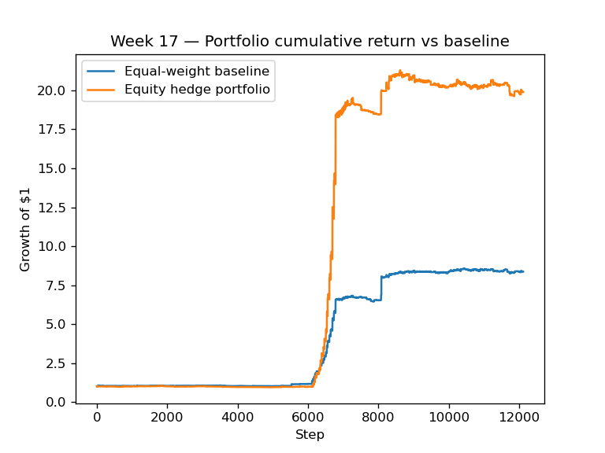
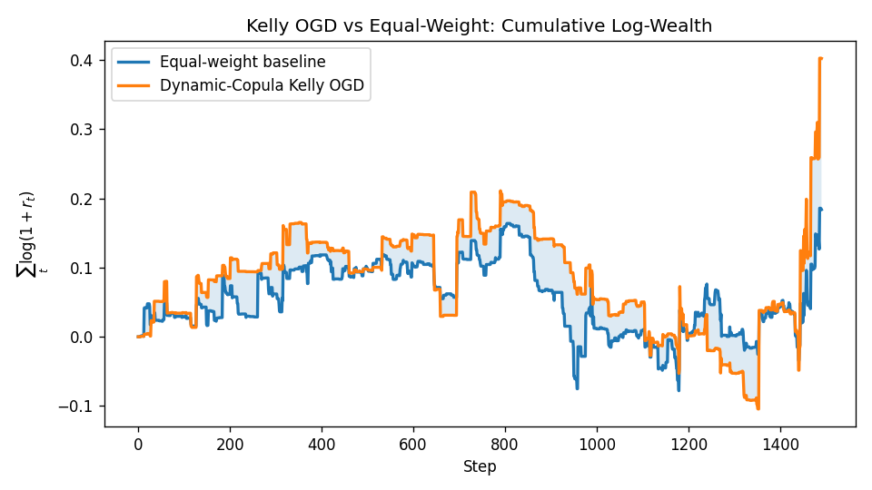
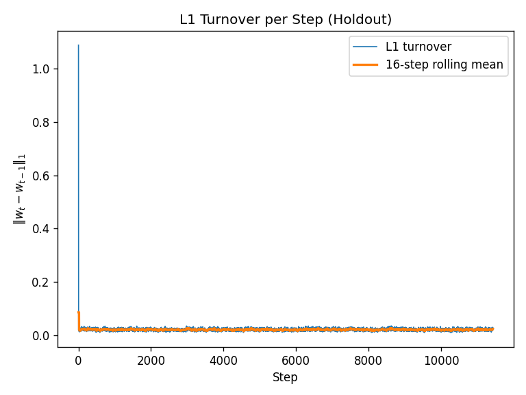

# Cross-Domain Portfolio Optimization on Polymarket

Adam Thomson, Allen Xia, Xinkai Yu

STAT 4830 Final Project

April 2026

**Reproduction.** From repo root: `bash script/install.sh`, `source .venv/bin/activate`, `pytest tests/`, then the pipelines linked in [`README.md`](README.md) (for example `python script/polymarket_week8_pipeline.py`, `python script/multiplatform_pipeline.py`, and the Week 10 Kelly script). Optuna QMC sampling may require `scipy` (listed in `requirements.txt`).

**Milestone report drafts** (snapshots): [`docs/milestones/report_drafts/`](docs/milestones/report_drafts/).

**Round 7 (Kelly fees / DD).** Full default-branch close-out and post-hoc tables: [`docs/week11_round7_diagnostics_report.md`](docs/week11_round7_diagnostics_report.md). K10E/K10F in-optimizer sweeps are documented on GPU runbook branches but **not** populated in §4–5 of that report on `main`.

## Abstract

This paper studies whether a differentiable portfolio optimizer can outperform a simple equal-weight allocation across Polymarket prediction contracts. Prediction markets are attractive for optimization because prices encode real-time event probabilities, but they are difficult because payoffs are binary, returns are non-Gaussian, and apparently distinct contracts often share a small number of latent event drivers. We construct a reproducible pipeline that pulls active Polymarket events, filters to binary Yes/No markets, maps contracts to event domains, builds token-level price histories, and evaluates online portfolio strategies on held-out bars.

We benchmark a fee-aware equal-domain-weight baseline against constrained mean-downside optimization, macro and stock-market overlays, and an expected-log-wealth Kelly model with a dynamic Gaussian copula. Our main finding is that equal weight is a surprisingly strong null: most mean-variance variants raise volatility or drawdown without improving risk-adjusted return. The most promising direction is the Kelly/copula family, which improves net gain in selected holdout windows but remains sensitive to turnover fees and single-seed instability. Recent fee-aware experiments show that a Week 17 optimized PM sleeve can generate extreme short-window gains relative to baseline, but attribution and data checks indicate that these gains are resolution-driven and not yet evidence of a deployable stock/PM trading edge. The project therefore supports a cautious conclusion: log-wealth objectives and dynamic dependence modeling are directionally useful, but robust deployment requires fee-aware training, multi-seed validation, richer equity data, and stronger controls for resolution-driven outliers.

## 1 Introduction

Prediction markets convert beliefs about future events into tradeable prices. A Polymarket YES contract priced at \(p\) behaves like a probability-weighted binary asset: it pays one dollar if the event resolves true and zero otherwise. This creates a natural portfolio problem. At each time step, an investor can allocate wealth across many contracts, observe price changes, and rebalance. The central question in our project is whether an optimizer can do better than the simplest possible benchmark: split capital evenly across a balanced set of active markets.

The question is not trivial. Traditional stock portfolios benefit from smooth returns, many independent sectors, and decades of historical data. Prediction-market portfolios instead face event clustering: a single political poll, AI product announcement, sports injury, or crypto shock may move many contracts together. A portfolio can look diversified by count while being concentrated in one latent driver. This motivates our original goal: build a cross-domain optimizer that caps exposure to individual event domains and improves risk-adjusted return relative to equal weight.

Over the semester, the project evolved from a constrained mean-variance optimizer into a broader investigation of why equal weight is hard to beat. We tried domain caps, covariance penalties, macro and ETF features, stock-market regime overlays, momentum pre-screening, learnable market selection, and finally a Kelly criterion objective with a dynamic Gaussian copula. The final draft below follows the reference report structure: data, methods, experiments, results, and limitations.

## 2 Data and Preprocessing

### 2.1 Polymarket Market and Price Data

The data pipeline begins with Polymarket event metadata from the Gamma API and token-level historical prices from the CLOB price history endpoint. Each event is flattened into individual markets, and the pipeline keeps binary Yes/No contracts with valid YES token identifiers. We filter administrative or rewards-related slugs, rank candidate domains by liquidity, require sufficient price history, and use a round-robin selection procedure to avoid letting one topic dominate the universe.

The mature Week 17 experiments use a 40-market universe with 40 event domains and a 20% holdout split. The Week 17 diagnostics record 48,474 tuning steps and 12,119 holdout steps, with 24 days of minimum history after backoff. This 40-market scale is a compromise: it is small enough for repeated online optimization, but broad enough to test domain concentration and diversification.

### 2.2 Domain Labels and Balanced Sampling

Each market is tagged to a domain such as `crypto-prices`, `formula1`, `best-of-2025`, congressional races, AI releases, or sports leagues. The domain labels are noisy but useful because they approximate the latent event clusters that a pure token-level optimizer might miss. Equal weight is implemented as equal total allocation per domain, split across the markets inside that domain. This makes the baseline stronger than naive per-token weighting when the number of markets per category is uneven.

### 2.3 Macro, Equity, and Fee Data

Several experiments attach outside data to the Polymarket book. The macro layer uses listed equity and volatility proxies such as SPY, VIX, XLE, XLV, XLF, QQQ, XLK, and defensive stocks to infer risk-on or risk-off conditions. The topic-aligned layer maps Polymarket domains to equity proxies, although the Week 17 run ultimately mapped all topics to SPY for stability. We also added a fee-aware accounting layer. A transaction fee rate \(f\) is charged per unit of L1 turnover:

\[
\text{cost}_t = f \lVert w_t - w_{t-1}\rVert_1.
\]

In the latest runs we use \(f = 0.001\), or 10 basis points per unit L1 turnover.

### 2.4 Data Limitations

The main limitations are data availability, non-stationarity, and resolution effects. Prediction-market prices can jump sharply near settlement, causing short-window returns that are mechanically large. In addition, the live stock/oil refresh failed for the Week 17 timestamp range; the available SPY/USO hedge series had no non-zero stock leg in the selected 7-day window. Therefore, the stock/PM comparison should be interpreted as an optimized Polymarket sleeve with stock-sleeve logic present but inactive, not as proof that a stock overlay generated alpha.

## 3 Methods

### 3.1 Fee-Aware Equal-Weight Baseline

The baseline is deliberately simple. For each available time step, it assigns equal total capital to each domain and equal market weights within each domain. If some markets are unavailable at a step, weights are renormalized over the available set. The realized portfolio return is

\[
R_t = w_t^\top r_t.
\]

To make the benchmark realistic, we now compute both gross and net returns, where net return subtracts transaction costs from dynamic-universe rebalancing:

\[
R_t^{\text{net}} = R_t^{\text{gross}} - f\lVert w_t - w_{t-1}\rVert_1.
\]

### 3.2 Constrained Mean-Downside Online Optimization

Our first optimizer is an online projected-gradient portfolio strategy. It maintains weights on the probability simplex, updates using rolling windows, and evaluates out of sample by continuing to adapt during holdout. The objective rewards mean return while penalizing variance, downside semivariance, domain overexposure, covariance concentration, and per-asset concentration. In simplified form:

\[
J(w) =
\mathbb{E}[R]
- \alpha \operatorname{Var}(R)
- \beta \mathbb{E}[\max(-R,0)^2]
- \lambda_d \sum_d \max(0,S_d(w)-L_d)^2
- \lambda_c \sum_i \max(0,w_i-w_{\max})^2
- \lambda_\Sigma w^\top \Sigma w.
\]

Weights are kept on the simplex by projection rather than softmax in later runs, allowing exact zero weights while enforcing nonnegative full investment. Hyperparameters are selected by Optuna QMC/Sobol search and evaluated on a walk-forward holdout.

### 3.3 Stock/Prediction-Market Combined Strategy

The combined stock/PM strategy has two roles for listed equities. First, equity and volatility indicators adjust concentration rules, so risk-off conditions tighten domain exposure. Second, an optional stock/oil hedge sleeve can blend lagged SPY and oil proxy returns with the Polymarket sleeve.

We recently added fee-aware sleeve accounting. When the PM-vs-stock allocation \(\alpha_t\) changes, the strategy pays \(f \cdot 2|\alpha_t - \alpha_{t-1}|\) because the two sleeve weights are \([1-\alpha_t, \alpha_t]\):

\[
R_t^{\text{combined, net}}
= (1-\alpha_t)R_t^{\text{PM, net}}
+ \alpha_t R_t^{\text{hedge}}
- f \cdot 2|\alpha_t-\alpha_{t-1}|.
\]

### 3.4 Kelly Objective and Dynamic Gaussian Copula

The most important methodological pivot is the Kelly model. Instead of optimizing a mean-variance surrogate, Kelly maximizes expected log wealth. For binary settlement outcomes \(y\), price \(p\), and portfolio weights \(w\), the objective is

\[
J_{\text{Kelly}}(w)
= \mathbb{E}_y[\log(1+w^\top \pi(y))],
\]

where \(\pi_i(y_i)\) is the per-share binary payoff relative to price. This is better aligned with compounded wealth than Sortino or Sharpe.

Dependence between binary markets is modeled using a dynamic Gaussian copula. A small MLP reads macro features such as SPY, QQQ, and BTC returns and emits a time-varying correlation matrix. Bernoulli outcomes are sampled through a straight-through estimator so that gradients can flow through the binary payoff simulation. The model jointly updates portfolio weights and copula parameters with Adam-OGD and projects weights back onto the simplex.

### 3.5 Evaluation Metrics

We report cumulative gain, log wealth, Sortino ratio, maximum drawdown, turnover, and transaction cost. Gain and log wealth measure growth; Sortino measures mean return per unit downside volatility; maximum drawdown measures worst peak-to-trough loss; turnover measures how much the strategy trades and therefore how fragile it is to fees. Because Polymarket frictions can be meaningful, net-of-fees comparisons are more important than gross comparisons.

## 4 Experiments and Results

### 4.1 Baseline vs Constrained Mean-Downside Optimizer

The Week 17 constrained optimizer did not beat the equal-weight baseline on risk-adjusted terms. On the aligned holdout segment, baseline Sortino was 0.1798 and constrained Sortino was 0.1538. The constrained optimizer achieved a higher mean step return, 0.000282 versus 0.000188, but it did so with higher volatility and deeper drawdown. This is a mean-risk trade rather than a clean improvement.

| Metric | Fee-Aware / Equal-Weight Baseline | Constrained / Optimized | Interpretation |
|---|---:|---:|---|
| Week 17 holdout Sortino | 0.1798 | 0.1538 | Optimizer lags baseline |
| Week 17 holdout max drawdown | -5.45% | -9.40% | Optimizer has deeper losses |
| Week 17 holdout mean return | 0.0001879 | 0.0002824 | Optimizer earns more mean return |
| Week 17 top contributor share | n/a | 98.2% | One resolution-driven market dominates |

**Figure 1:** Week 17 equity curve comparison for the constrained stock/PM experiment.

### 4.2 Stock/PM Combined Strategy With Fee Awareness

The latest stock/PM comparison was rerun over the past 7 calendar days available in the Week 17 data, from `2026-04-10T06:21:59+00:00` to `2026-04-17T06:21:59+00:00`. The fee-aware baseline charges 10 bps per unit L1 turnover. The optimized PM leg also pays token-weight turnover fees, and the stock/PM sleeve now pays additional allocation-change fees.

In this window, however, the stock/oil leg had no non-zero SPY/USO data, so the optimizer selected `alpha_stock_hedge = 0.0`. The result is therefore an optimized PM net-of-fees strategy rather than an active stock hedge.

| 7-Day Metric | Fee-Aware Baseline | Optimized Stock/PM Net of Fees |
|---|---:|---:|
| Gain | +825.79% | +13020.43% |
| Max drawdown | -5.45% | -13.70% |
| Sortino | 0.0661 | 0.1531 |
| PM transaction cost | included in baseline | 0.0166 |
| Stock sleeve transaction cost | n/a | 0.0000 |

**Figure 2:** Illustrative combined-strategy equity comparison from a related beat-baseline diagnostic (`figures/week16_rr_beatbaseline_*`). The Week 17 seven-day fee-aware window in the table below is documented in `data/processed/week17_stock_pm_7d_feeaware_summary.json`; regenerate a dedicated figure from your latest stock/PM script if required for submission PDF.

The return magnitude in Figure 2 is too large to treat as a stable deployable edge. The Week 17 attribution report shows that resolution-driven events can dominate portfolio contribution. This plot is useful evidence that the optimizer can capture short-run PM jumps, but it also motivates stronger outlier controls and more realistic execution assumptions.

### 4.3 Kelly Model vs Fee-Aware Baseline

We compared five completed Kelly runs against a newly generated fee-aware baseline at the same 10 bps turnover fee. The best candidate by excess gain was `week14_M_seed7`, covering `2026-04-14T21:00:47+00:00` to `2026-04-22T10:10:04+00:00`. Kelly net gain was +47.01%, compared with fee-aware baseline gain of +20.18%. The excess gain was +26.82 percentage points.

| Kelly Run | Kelly Net Gain | Baseline Gain | Excess Gain | Kelly Turnover Cost |
|---|---:|---:|---:|---:|
| `week14_M_seed7` | +47.01% | +20.18% | +26.82 pp | 0.0171 |
| `week10_kelly_D` | +56.17% | +50.39% | +5.78 pp | 0.2319 |
| `week14_MF_seed7` | +27.59% | +37.84% | -10.25 pp | 0.0180 |
| `week14_M_smoke` | -1.91% | +10.01% | -11.93 pp | 0.0533 |
| `week10_kelly_C` | -29.99% | +50.39% | -80.38 pp | 1.2243 |

**Figure 3:** Kelly vs equal-weight baseline on the `week14_M_seed7` holdout (log-wealth diagnostic). Numeric fee-aware comparison tables are in `data/processed/kelly_feeaware_comparison_summary.json`.

The Kelly results are more plausible than the extreme 7-day Week 17 PM result: gains are smaller, turnover costs are visible, and the comparison is across completed Kelly holdout windows. The best run improves growth but has a larger maximum drawdown than the baseline, so the improvement is not uniformly risk reducing.

### 4.4 Turnover, Fees, and the K10C/K10D Lesson

The earlier K10C run had a strong gross log-wealth edge but was highly fee-fragile. The final presentation guide records a break-even fee of only 3.76 bps for K10C, while a 10 bps fee flips the result negative. K10D adds an L1 turnover penalty and cuts average turnover by roughly five times, preserving part of the edge. This explains why the final report should emphasize fee-aware training, not just fee-aware reporting.

**Figure 4:** K10D turnover per step. The L1 turnover penalty reduces churn relative to higher-turnover Kelly variants and is a direct response to fee fragility.

### 4.5 Why Equal Weight Is Hard to Beat

Across the experiments, equal weight remains a strong null hypothesis for three reasons. First, the selected PM universe often has a dominant latent risk factor, so many markets move together. Second, the domain-balanced baseline benefits from resolution events without paying model risk. Third, optimizers can overfit noisy short histories, especially when a single market resolution explains most of the return. The Week 17 constrained run is the clearest example: one `best-of-2025` contract accounted for roughly 98.2% of total contribution.

This diagnosis does not mean optimization is useless. Rather, it changes the target. A useful optimizer should improve compounded growth after costs, maintain tolerable drawdowns, and remain stable across seeds and market windows. The Kelly family is the closest to that target, but still requires stronger robustness checks.

## 5 Conclusion and Future Work

This project began with a simple optimization question: can a differentiable domain-constrained optimizer beat equal weight on Polymarket? The answer for mean-downside and MVO-style methods is mostly no. Baseline equal-domain weighting is already strong, and most constrained variants either collapse toward it or take more risk without improving Sortino or drawdown. Macro and stock-market information helped as diagnostics and regime context, but the Week 17 best trial turned off the equity-signal reward channel, suggesting that the topic-to-stock link was not strong enough in the available data.

The strongest methodological direction is Kelly optimization with dynamic dependence modeling. Expected log wealth matches the binary, multiplicative nature of prediction-market payoffs better than a variance proxy. Dynamic copulas also provide a principled way to condition correlation on macro features. However, the Kelly results are not yet decisive. They are fee-sensitive, drawdown-prone, and need multi-seed confirmation. The latest fee-aware comparisons show why: gross gains can look spectacular, but realistic turnover fees, resolution outliers, and missing stock data can change the interpretation.

Future work should focus on four concrete improvements:

- Train with transaction fees inside every objective, not only as a post-hoc comparison.
- Run multi-seed and multi-window validation for Kelly, K10D, and momentum-filtered Kelly variants.
- Build a more reliable stock/ETF feature store so the stock/PM combined strategy can be tested with non-zero equity legs over matching timestamps.
- Add outlier and resolution-event diagnostics so short-window gains are separated into repeatable alpha versus one-off settlement jumps.

Overall, the final lesson is methodological rather than purely performance-based. Equal weight is not a strawman in prediction markets; it is a serious benchmark. Beating it requires objectives that match binary settlement, friction-aware rebalancing, and evidence that survives more than one lucky resolution window.

## References and Artifacts

- `src/baseline.py` — fee-aware equal-domain-weight baseline.
- `src/constrained_optimizer.py` — projected-simplex online mean-downside optimizer.
- `src/kelly_copula_optimizer.py` — dynamic-copula Kelly OGD implementation.
- `src/stock_oil_hedge.py` — stock/PM sleeve and transaction-fee-aware combination logic.
- `docs/final_presentation_guide.md` and `docs/final_presentation_technical_primer.md` — final narrative, formulas, and result interpretation.
- `data/processed/week17_stock_pm_7d_feeaware_summary.json` — latest stock/PM fee-aware comparison.
- `data/processed/kelly_feeaware_comparison_summary.json` — Kelly fee-aware comparison across completed runs.

## Submission checklist

- Add any **instructor-required** title-page fields when exporting to PDF.
- Optional: move the extreme Week 17 seven-day window to an appendix if the course prefers a calmer main text.
- Add formal **bibliography** entries if the syllabus requires them (Kelly 1956; Markowitz 1952; Kingma & Ba 2014 for Adam; Optuna; copula references).
